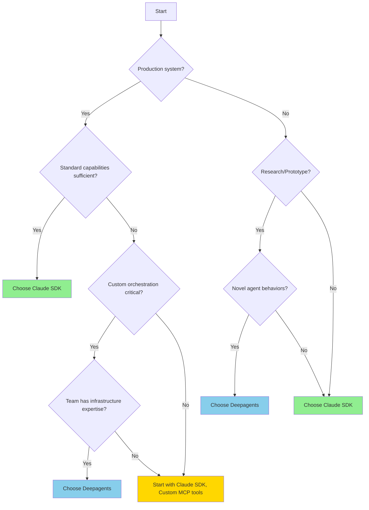

# Framework Selection Guide

## Decision Framework

This guide helps you choose between deepagents and Claude SDK based on your specific project requirements, team capabilities, and business constraints.

## Quick Decision Tree



## Evaluation Dimensions

### 1. Project Maturity & Goals

#### Early Stage (Proof of Concept)

**Choose Claude SDK if**:
✅ Need to validate feasibility quickly
✅ Want to demo to stakeholders fast
✅ Standard agent capabilities likely sufficient
✅ May pivot based on feedback

**Choose Deepagents if**:
✅ Exploring novel agent architectures
✅ Researching new orchestration strategies
✅ Need flexibility to experiment
✅ PoC will inform custom production system

#### Mid Stage (MVP / Beta)

**Choose Claude SDK if**:
✅ Moving quickly toward production
✅ Team wants proven patterns
✅ Time-to-market critical
✅ Limited infrastructure resources

**Choose Deepagents if**:
✅ MVP validates need for customization
✅ Standard patterns insufficient
✅ Team comfortable with complexity
✅ Custom features are differentiators

#### Late Stage (Production)

**Choose Claude SDK if**:
✅ Stability and reliability paramount
✅ Maintenance minimization valued
✅ Security/compliance requirements
✅ Standard capabilities meet needs

**Choose Deepagents if**:
✅ Custom orchestration provides competitive advantage
✅ Team has mature operations practices
✅ Ongoing customization expected
✅ Framework independence important

### 2. Technical Requirements

#### Orchestration Complexity

| Requirement | Deepagents | Claude SDK |
|-------------|-----------|------------|
| **Sequential tool calls** | ✅ Explicit control | ✅ LLM manages |
| **Parallel execution** | ✅ Custom async logic | ⚠️ LLM may parallelize |
| **Conditional branching** | ✅ Full control | ⚠️ LLM-dependent |
| **Complex state machines** | ✅ Implement any pattern | ❌ Limited support |
| **Deterministic workflows** | ✅ Guaranteed order | ❌ LLM decides |

**Recommendation**:
- **Claude SDK**: If LLM-driven orchestration acceptable
- **Deepagents**: If deterministic control required

#### Tool Integration Needs

| Requirement | Deepagents | Claude SDK |
|-------------|-----------|------------|
| **Standard CRUD tools** | ✅ Easy | ✅ MCP protocol |
| **Custom Python tools** | ✅ Direct functions | ⚠️ Via MCP server |
| **External APIs** | ✅ Direct integration | ⚠️ Via MCP wrapper |
| **Streaming data** | ✅ Custom handling | ⚠️ Limited support |
| **Tool composition** | ✅ Python-level | ❌ MCP constraints |
| **100+ tools** | ⚠️ Context limits | ⚠️ Context limits |

**Recommendation**:
- **Claude SDK**: If standard tool patterns fit
- **Deepagents**: If complex tool coordination needed

#### Performance Requirements

| Requirement | Deepagents | Claude SDK |
|-------------|-----------|------------|
| **Custom caching** | ✅ Full control | ⚠️ MCP server level |
| **Batching** | ✅ Custom implementation | ⚠️ Tool-level only |
| **Connection pooling** | ✅ Custom management | ⚠️ MCP managed |
| **Query optimization** | ✅ Domain-specific | ❌ LLM decides |
| **Response streaming** | ⚠️ Custom implementation | ✅ Built-in |

**Recommendation**:
- **Claude SDK**: If standard performance adequate
- **Deepagents**: If domain-specific optimization critical

### 3. Team Capabilities

#### Developer Experience Level

**Choose Claude SDK if**:
- Team new to LLM agents
- Mix of junior/senior developers
- Limited infrastructure expertise
- Prefer standard patterns

**Choose Deepagents if**:
- Team experienced with LLM agents
- Strong Python infrastructure skills
- Comfortable with complexity
- Enjoy building custom solutions

#### Team Size & Structure

| Team Profile | Recommendation | Reasoning |
|-------------|---------------|-----------|
| **1-2 developers** | Claude SDK | Minimize maintenance burden |
| **Small team (3-5)** | Claude SDK | Focus on business logic |
| **Medium team (6-15)** | Either | Depends on expertise distribution |
| **Large team (15+)** | Deepagents | Can absorb maintenance costs |
| **Dedicated infrastructure team** | Deepagents | Infrastructure expertise available |
| **Product-focused team** | Claude SDK | Minimize infrastructure work |

#### Maintenance Capacity

**Choose Claude SDK if**:
- Limited ongoing maintenance capacity
- Team stretched across projects
- Prefer managed solutions
- Want predictable maintenance load

**Choose Deepagents if**:
- Capacity for ongoing customization
- Dedicated agent platform team
- Active agent research program
- Maintenance cost acceptable

### 4. Business Constraints

#### Time-to-Market

| Timeline | Recommendation | Development Time |
|----------|---------------|------------------|
| **< 2 weeks** | Claude SDK | 2-3 days to working agent |
| **2-4 weeks** | Claude SDK | 1 week to production-ready |
| **1-2 months** | Either | Time for custom development |
| **3+ months** | Deepagents | Justify custom investment |

#### Budget Considerations

**Claude SDK Cost Profile**:
- Low initial development cost
- Predictable maintenance costs
- SDK managed (no surprise costs)
- Anthropic API costs

**Deepagents Cost Profile**:
- Higher initial development cost
- Variable maintenance costs
- Custom infrastructure costs
- Any LLM provider costs

**Total Cost of Ownership (First Year)**:

| Cost Category | Deepagents | Claude SDK |
|--------------|-----------|------------|
| Development | $40k-80k | $10k-20k |
| Infrastructure | $5k-15k | $3k-8k |
| Maintenance | $15k-30k | $5k-10k |
| Security | $10k-20k | Included |
| **Total** | **$70k-145k** | **$18k-38k** |

**Recommendation**:
- **Claude SDK**: If budget constrained or unknown requirements
- **Deepagents**: If customization ROI justifies cost

#### Compliance & Security

**Choose Claude SDK if**:
- Need audit trails out-of-box
- Compliance requirements standard
- Prefer managed security
- Limited security expertise

**Choose Deepagents if**:
- Unusual compliance requirements
- Custom audit needs
- Security team prefers control
- Data residency requirements

### 5. Strategic Considerations

#### Vendor Lock-in Tolerance

**Claude SDK**:
- ❌ Tied to Anthropic ecosystem
- ❌ Migration to other LLMs difficult
- ✅ Stable, supported platform
- ✅ Feature improvements automatic

**Deepagents**:
- ✅ Framework-agnostic
- ✅ Any LLM provider
- ❌ Must maintain abstraction layer
- ❌ Responsible for updates

**Recommendation**:
- **Claude SDK**: If Anthropic commitment acceptable
- **Deepagents**: If multi-provider strategy important

#### Innovation Velocity

**Choose Claude SDK if**:
- Innovation primarily in business logic
- Standard agent capabilities sufficient
- Fast iteration more important than flexibility

**Choose Deepagents if**:
- Innovation in agent orchestration itself
- Novel agent behaviors are differentiator
- Custom agent architecture provides advantage

#### Scale & Growth

**Choose Claude SDK if**:
- Scaling primarily about request volume
- Stateless agent architecture
- Standard deployment patterns

**Choose Deepagents if**:
- Scaling requires custom optimization
- Complex stateful workflows
- Domain-specific scaling patterns

## Decision Matrices

### Matrix 1: By Use Case

| Use Case | Recommended | Why |
|----------|-------------|-----|
| **Customer support bot** | Claude SDK | Standard conversational patterns |
| **Internal tooling** | Claude SDK | Rapid development priority |
| **Research assistant** | Claude SDK | Natural LLM orchestration |
| **Code generation** | Claude SDK | Leverages Claude Code capabilities |
| **Infrastructure automation** | Either | Depends on complexity |
| **Data analysis** | Deepagents | Custom orchestration valuable |
| **Novel agent research** | Deepagents | Need experimental flexibility |
| **Multi-step workflows** | Deepagents | Deterministic control valuable |

### Matrix 2: By Industry

| Industry | Typical Choice | Rationale |
|----------|---------------|-----------|
| **Startups** | Claude SDK | Fast time-to-market |
| **Enterprise** | Claude SDK | Compliance, support, stability |
| **Research institutions** | Deepagents | Need flexibility, customization |
| **Tech companies** | Either | Depends on team capabilities |
| **Finance** | Claude SDK | Compliance, audit trails |
| **Healthcare** | Claude SDK | Regulatory requirements |

## Hybrid Strategies

### Strategy 1: Start Small, Expand Selectively

```
Phase 1: Claude SDK for core functionality
  ↓
Phase 2: Identify limitations through usage
  ↓
Phase 3: Build custom tools as MCP servers
  ↓
Phase 4: Migrate to Deepagents only if necessary
```

**Best for**: Uncertain requirements, risk-averse teams

### Strategy 2: Parallel Development

```
Production: Claude SDK (stable, reliable)
    +
R&D: Deepagents (experiments, innovations)
    ↓
Successful experiments → MCP tools → Production
```

**Best for**: Large teams with R&D capacity

### Strategy 3: Phased Migration

```
Phase 1: Prototype with Deepagents
  ↓
Phase 2: Extract stable patterns
  ↓
Phase 3: Implement as MCP servers
  ↓
Phase 4: Deploy with Claude SDK
```

**Best for**: Novel requirements needing validation

## Common Scenarios & Recommendations

### Scenario 1: Infrastructure Query Agent (Our NetBox Case)

**Requirements**:
- Natural language infrastructure queries
- Multi-step tool coordination
- Read-heavy operations
- Production deployment

**Recommendation**: **Both frameworks successful**
- Claude SDK: Faster development, production-ready
- Deepagents: More control, custom optimization

**Actual Choice**: Both implemented for comparison study

### Scenario 2: Multi-Agent Research System

**Requirements**:
- Sub-agent spawning
- Novel orchestration patterns
- Experimental workflows
- Research focus

**Recommendation**: **Deepagents**
- Flexibility for experimentation
- Custom sub-agent patterns
- Framework independence

### Scenario 3: Customer Support Automation

**Requirements**:
- Conversational interface
- Standard tool integration (CRM, ticketing)
- Compliance & audit trails
- Fast deployment

**Recommendation**: **Claude SDK**
- Natural conversational flow
- Built-in safety controls
- MCP servers for integrations
- Production-ready quickly

### Scenario 4: Data Analysis Pipeline

**Requirements**:
- Complex multi-step workflows
- Custom data transformations
- Deterministic execution
- Performance critical

**Recommendation**: **Deepagents**
- Explicit workflow control
- Custom optimization
- Domain-specific patterns
- Guaranteed execution order

## Final Recommendation Framework

### Score Your Project (1-5 scale)

| Dimension | Score | Weight |
|-----------|-------|--------|
| Need for customization | __ | 3x |
| Team infrastructure expertise | __ | 2x |
| Time-to-market pressure | __ | 2x |
| Budget constraints | __ | 1x |
| Maintenance capacity | __ | 2x |
| Compliance requirements | __ | 1x |

### Calculation

```
Claude SDK Score =
  (5 - customization_need) * 3 +
  (5 - team_expertise) * 2 +
  time_pressure * 2 +
  budget_constraints * 1 +
  (5 - maintenance_capacity) * 2 +
  (5 - compliance_complexity) * 1

Deepagents Score =
  customization_need * 3 +
  team_expertise * 2 +
  (5 - time_pressure) * 2 +
  (5 - budget_constraints) * 1 +
  maintenance_capacity * 2 +
  compliance_complexity * 1
```

**Interpretation**:
- **Claude SDK Score > Deepagents Score + 10**: Strongly favor Claude SDK
- **Scores within 10 points**: Either framework viable
- **Deepagents Score > Claude SDK Score + 10**: Strongly favor Deepagents

## Conclusion

**For most production LLM agent applications**: **Choose Claude SDK**

Reasons:
- Faster time-to-market
- Lower total cost of ownership
- Production-ready out-of-box
- Managed complexity
- Standard patterns

**Choose Deepagents when**:
- Custom orchestration provides competitive advantage
- Team has infrastructure expertise
- Novel agent behaviors required
- Framework independence critical
- Customization ROI clearly justified

**Remember**: You can start with one framework and migrate later if requirements change. The best choice depends on your specific context.

## Next Steps

After making your decision:

1. **If choosing Claude SDK**: Review [Claude SDK Architecture](../phases/phase-4-framework-comparison/claude-sdk-architecture.md)
2. **If choosing Deepagents**: Review [Deepagents Architecture](../phases/phase-4-framework-comparison/deepagents-architecture.md)
3. **If unsure**: Review [Comparative Analysis](../phases/phase-4-framework-comparison/comparative-analysis.md)

For detailed implementation examples, see the [Phase 4 framework comparison case studies](../phases/phase-4-framework-comparison/overview.md).
