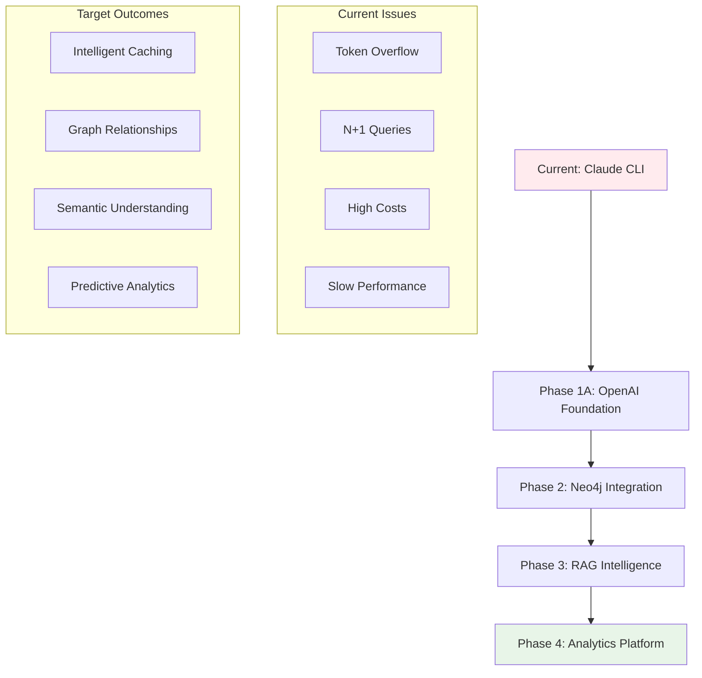
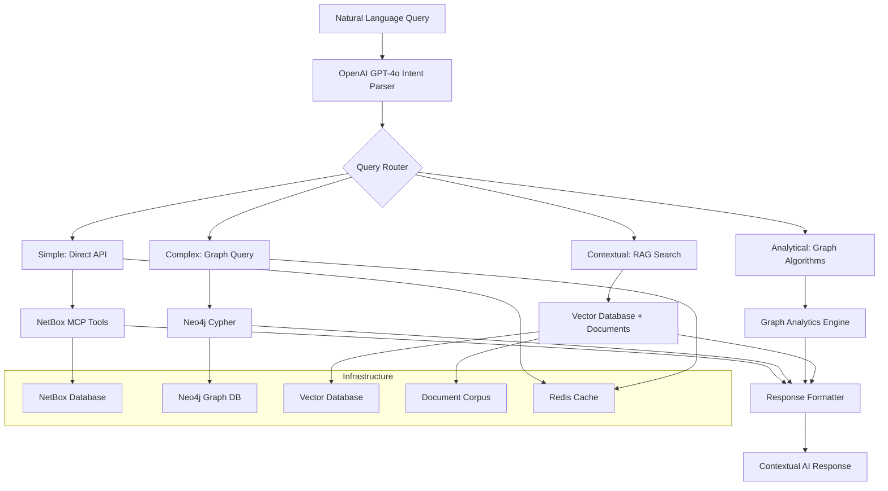

# Comprehensive Four-Phase Orchestration Plan

## Strategic Vision

Transform NetBox from a static data repository into an **intelligent infrastructure advisor** through progressive enhancement with modern AI orchestration technologies.

## Architecture Transformation Overview



## Performance Transformation Targets

### Cost Optimization
- **Current**: $0.13 per query (Claude CLI overhead)
- **Target**: $0.001 per query (99% reduction)
- **Method**: Replace expensive Claude CLI with efficient OpenAI GPT-4o-mini

### Query Performance  
- **Simple queries**: 3-10 seconds → 200ms-1 second (15x improvement)
- **Complex queries**: 30 seconds-3 minutes → 1-3 seconds (20-50x improvement)
- **Method**: Pre-computed graph relationships + intelligent caching

### Capability Enhancement
- **Current**: Basic CRUD operations with manual relationship traversal
- **Target**: Predictive analytics, operational intelligence, institutional memory
- **Method**: RAG-powered contextual understanding + graph algorithms

## Phase Progression Strategy

### Phase 1A: Foundation & Quick Wins
**Investment**: Moderate (primarily development time)  
**ROI**: Immediate 90% cost reduction + 15x performance improvement

**Core Objectives**:
- Replace Claude CLI with OpenAI GPT-4o-mini intent parsing
- Implement LangGraph tool chain orchestration  
- Solve critical token overflow and N+1 query issues
- Establish reliable foundation for advanced features

### Phase 2: Neo4j Graph Intelligence  
**Investment**: Higher (Neo4j infrastructure + data migration)
**ROI**: Enable previously impossible relationship queries

**Core Objectives**:  
- Deploy Neo4j graph database with NetBox schema mapping
- Implement real-time synchronization via webhooks
- Build Cypher query capabilities for complex relationships
- Create hybrid routing (graph vs. direct API calls)

### Phase 3: RAG-Powered Semantic Intelligence
**Investment**: Highest (document processing + vector database)  
**ROI**: Transform system into organizational knowledge advisor

**Core Objectives**:
- Ingest operational documentation, runbooks, incident reports
- Implement semantic search across structured + unstructured data (expanding beyond API endpoint routing)
- Build contextual recommendation engine
- Create institutional memory integration

### Phase 4: Advanced Analytics Platform
**Investment**: Moderate (algorithm development + UI enhancements)
**ROI**: Predictive capabilities worth 10-100x operational efficiency gains

**Core Objectives**:
- Deploy graph algorithms for network analysis
- Build predictive models for capacity planning
- Create operational intelligence dashboards  
- Implement automated optimization recommendations

## Technology Stack Evolution

### Current Architecture
```
User Query → Claude CLI → NetBox MCP Tools → NetBox API → Response
```

### Target Architecture (Phase 4)


## Investment & Resource Requirements

### Phase 1A: Foundation ($)
- **Development**: 2-3 senior developers
- **Infrastructure**: Minimal (existing systems + OpenAI API)
- **Risk**: Low (incremental improvement to existing system)

### Phase 2: Graph Integration ($$)
- **Development**: 2-3 developers + Neo4j specialist
- **Infrastructure**: Neo4j Enterprise + additional server capacity
- **Risk**: Medium (new technology integration complexity)

### Phase 3: RAG Intelligence ($$$)  
- **Development**: 3-4 developers + ML engineer
- **Infrastructure**: Vector database + document processing pipeline + storage
- **Risk**: Medium-High (document quality dependency + ML complexity)

### Phase 4: Analytics Platform ($$)
- **Development**: 2-3 developers + data scientist
- **Infrastructure**: Analytics processing + dashboard hosting
- **Risk**: Low-Medium (building on established foundation)

## Success Metrics & KPIs

### Technical Performance
- **Query Response Time**: Track percentile improvements (P50, P95, P99)
- **System Availability**: Target 99.9% uptime with graceful degradation
- **Cost per Query**: Monitor total cost of ownership reduction
- **Cache Hit Rates**: Measure efficiency of intelligent caching

### User Experience  
- **Query Success Rate**: Percentage of queries that produce useful results
- **User Satisfaction**: Survey scores for response quality and relevance
- **Query Complexity**: Track ability to handle increasingly complex requests  
- **Learning Curve**: Time for new users to become productive

### Business Value
- **Operational Efficiency**: Reduction in manual network analysis time
- **Problem Resolution Speed**: Faster incident response and troubleshooting
- **Knowledge Retention**: Reduced dependency on specialized staff knowledge
- **Decision Support Quality**: Accuracy of recommendations and predictions

## Risk Mitigation Strategies

### Technical Risks
- **Phased rollout** with parallel legacy system operation
- **Comprehensive testing** at each phase before progression
- **Rollback capabilities** for each major component
- **Performance monitoring** with automated alerting

### Operational Risks  
- **Staff training** programs for each new capability
- **Documentation maintenance** as system capabilities evolve
- **Change management** processes for infrastructure updates
- **Backup systems** for critical operational dependencies

### Strategic Risks
- **Technology evolution** monitoring and adaptation planning  
- **Vendor dependency** mitigation through open-source alternatives
- **Scalability planning** for organizational growth
- **Security considerations** for AI and data access patterns

## Expected Transformational Impact

By Phase 4 completion, the system will transform from a basic network documentation interface into a comprehensive **Infrastructure Intelligence Platform** that:

- **Predicts problems** before they impact operations
- **Recommends optimizations** based on operational history and best practices
- **Provides institutional knowledge** accessible through natural language
- **Automates complex analysis** that previously required specialized expertise
- **Integrates seamlessly** with existing operational workflows

This transformation represents a fundamental shift from reactive infrastructure management to proactive, intelligent infrastructure orchestration.