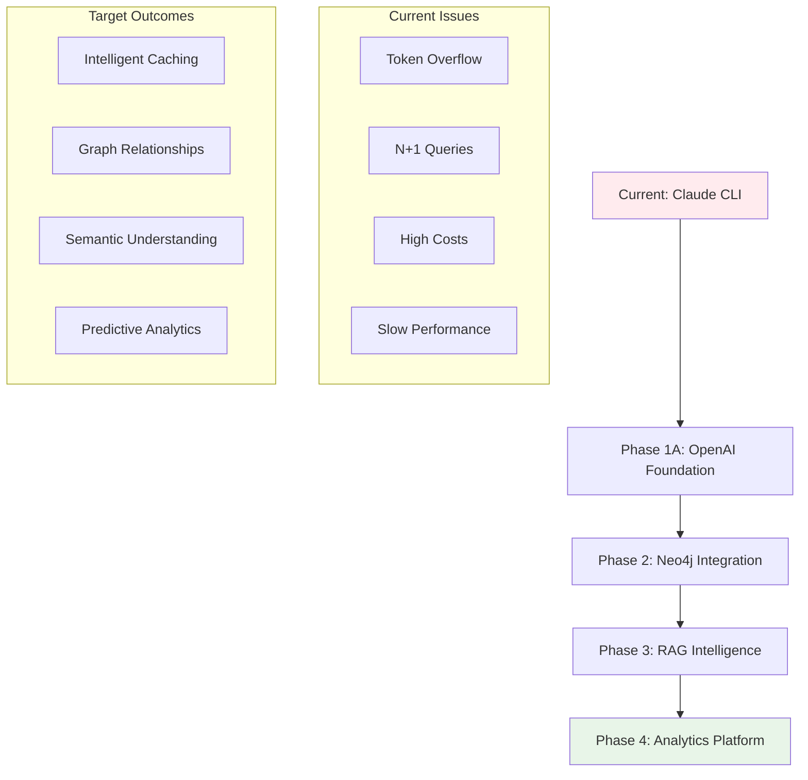
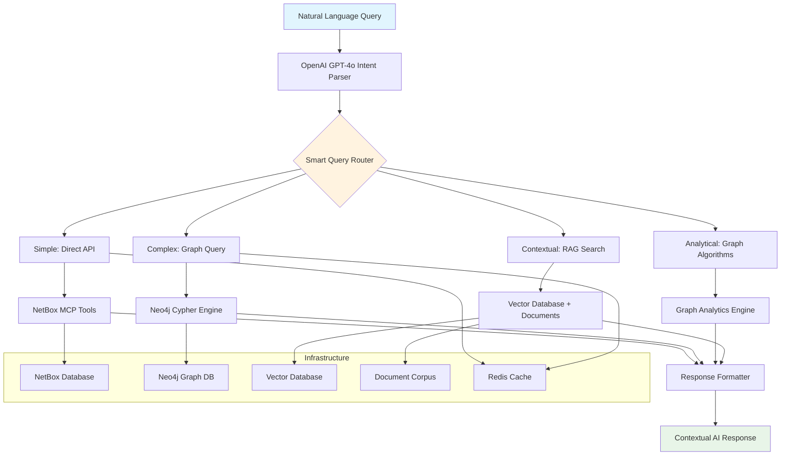

# Comprehensive Four-Phase Orchestration Plan

## Strategic Vision

Transform NetBox from a static data repository into an **intelligent infrastructure advisor** through progressive enhancement with modern AI orchestration technologies.

## Architecture Transformation Overview



## Performance Transformation Targets

### Cost Optimization
- **Current**: $0.13 per query (Claude CLI overhead)
- **Target**: $0.001 per query (99% reduction)
- **Method**: Replace expensive Claude CLI with efficient OpenAI GPT-4o-mini

### Query Performance  
- **Simple queries**: 3-10 seconds → 200ms-1 second (15x improvement)
- **Complex queries**: 30 seconds-3 minutes → 1-3 seconds (20-50x improvement)
- **Method**: Pre-computed graph relationships + intelligent caching

### Capability Enhancement
- **Current**: Basic CRUD operations with manual relationship traversal
- **Target**: Predictive analytics, operational intelligence, institutional memory
- **Method**: RAG-powered contextual understanding + graph algorithms

## Phase Progression Strategy

### Phase 1A: Foundation & Quick Wins
**Investment**: Moderate (primarily development time)  
**ROI**: Immediate 90% cost reduction + 15x performance improvement

**Core Objectives**:
- Replace Claude CLI with OpenAI GPT-4o-mini intent parsing
- Implement LangGraph tool orchestration for existing NetBox MCP tools
- Provide graceful handling of token overflow and N+1 query limitations
- Establish reliable coordination foundation for advanced features

**Technical Implementation Details**:

**OpenAI-Powered Query Classification System**
- Build intent recognition using GPT-4o-mini to understand user query intent
- Distinguish between simple lookups and complex multi-step queries
- Map user questions to appropriate existing NetBox MCP tool chains
- Handle variations in query phrasing and provide graceful error handling
- Create intelligent routing for different query types using existing tools

**LangGraph Tool Orchestration Engine**
- Coordinate existing NetBox MCP tools through intelligent orchestration
- Document device → interface → cable relationship chains using current tools
- Map site → rack → device → utilization workflows using LangGraph state machines
- Build coordination engine for multiple existing NetBox operations in sequence
- Implement error recovery, progress tracking, and result aggregation

**Performance & User Experience Optimization**
- Replace Claude CLI process spawning with direct coordination of NetBox MCP tools
- Add intelligent caching using Redis for frequently requested data
- Implement graceful limitation handling for known tool constraints
- Build retry logic and fallback strategies for tool limitations
- Add streaming responses and progress indicators for long-running orchestrations

**Success Metrics**:
- Simple queries complete in under 2 seconds (vs current 3-10 seconds)
- Complex multi-step queries complete in under 30 seconds (vs current 3+ minutes)
- 90% cost reduction through elimination of Claude CLI overhead
- 100% query success rate without requiring multiple attempts

### Phase 2: Neo4j Graph Intelligence  
**Investment**: Higher (Neo4j infrastructure + data coordination)
**ROI**: Enable previously impossible relationship queries

**Core Objectives**:  
- Deploy Neo4j graph database populated via existing NetBox MCP tools
- Implement data synchronization using current tool capabilities
- Build Cypher query capabilities leveraging coordinated data extraction
- Create hybrid routing (graph vs. orchestrated tool chains)

**Technical Implementation Details**:

**Schema Discovery & Design**
- Analyze all 142+ available NetBox MCP tools to understand data relationships
- Map entity types (devices, sites, racks, cables, interfaces, IPs) via existing tools
- Identify relationships through coordinated tool chain analysis
- Design Neo4j graph schema based on tool-accessible data structures
- Plan hierarchical, connectivity, and logical relationships using orchestrated data

**Data Population Pipeline**
- Create orchestrated process to extract data using existing 142+ MCP tools
- Implement parallel tool coordination using asyncio for efficient Neo4j population
- Build relationship detection through intelligent tool chain orchestration
- Create validation using graph constraints coordinated with tool responses
- Design population process using batched tool orchestration

**Graph Query Capabilities Using Cypher**
- Build capability to traverse device connections using Cypher queries
- Create impact analysis queries using graph traversal algorithms
- Implement network path finding using Neo4j shortest path algorithms
- Add power dependency mapping using graph relationship analysis
- Create VLAN and network segmentation queries using pattern matching

**Synchronization System**
- Design system to detect changes in NetBox using webhook integration
- Implement incremental updates to Neo4j when NetBox changes
- Build conflict resolution using graph merge strategies
- Create monitoring to ensure synchronization stays current
- Design rollback capability using Neo4j transaction management

**Hybrid System Integration**
- Enhance query classification using GPT-4o-mini to identify graph-suitable queries
- Build decision logic using LangGraph for when to use graph vs tool chains
- Implement fallback to tool chains when graph data insufficient
- Create performance monitoring to optimize routing decisions

**Success Metrics**:
- Relationship queries complete in under 1 second using graph traversal
- Complex infrastructure audits complete in under 3 seconds using optimized Cypher
- New query capabilities that were impossible with tool chains
- Graph stays synchronized with NetBox within 5 minutes using real-time updates

### Phase 3: RAG-Powered Semantic Intelligence
**Investment**: Highest (document processing + vector database)  
**ROI**: Transform system into organizational knowledge advisor

**Core Objectives**:
- Ingest operational documentation, runbooks, incident reports
- Implement semantic search across structured + unstructured data (expanding beyond API endpoint routing)
- Build contextual recommendation engine
- Create institutional memory integration

**Technical Implementation Details**:

**Document Corpus Development**
- Collect and process runbooks, procedures, and operational documentation
- Ingest historical incident reports and post-mortems using document processing
- Process configuration templates and standards documentation
- Import change management records and impact assessments using data pipelines
- Collect vendor documentation and best practices using web scraping

**Document Processing Pipeline**
- Build document chunking system using semantic segmentation for technical content
- Implement embedding generation using OpenAI text-embedding models
- Create vector storage using Chroma or Pinecone for semantic search
- Design document versioning and update management using metadata tracking
- Build content validation and quality assurance using automated checks

**Semantic Search Integration**
- Deploy vector database infrastructure using cloud-native solutions
- Implement semantic search capabilities using cosine similarity
- Build query expansion using embedding similarity
- Create contextual retrieval using query understanding
- Design relevance scoring using multiple ranking factors

**RAG Query Enhancement**
- Integrate document retrieval with existing query classification using hybrid search
- Build context augmentation for infrastructure queries using retrieved documents
- Implement source attribution and citation using document metadata
- Create confidence scoring for RAG-enhanced responses using multiple signals
- Design fallback strategies when relevant documents aren't found

**Contextual Intelligence Development**
- Build historical analysis using document patterns and infrastructure data
- Implement similarity detection for current issues using past incident reports
- Create recommendation engine using historical solutions and outcomes
- Build change impact prediction using historical change records
- Design preventive maintenance suggestions using operational patterns

**Institutional Memory Integration**
- Connect current infrastructure queries with historical context using semantic search
- Build expertise recommendations using document analysis and team knowledge
- Implement best practice suggestions using policy and procedure documents
- Create compliance checking using regulatory and standard documents
- Design knowledge gap identification using document coverage analysis

**Success Metrics**:
- Queries include relevant operational context from institutional knowledge
- System provides proactive recommendations based on historical patterns
- Users receive guidance that incorporates organizational best practices
- Response quality significantly improved through contextual understanding
- Institutional knowledge becomes accessible through natural language queries

### Phase 4: Advanced Analytics Platform
**Investment**: Moderate (algorithm development + UI enhancements)
**ROI**: Predictive capabilities worth 10-100x operational efficiency gains

**Core Objectives**:
- Deploy graph algorithms for network analysis
- Build predictive models for capacity planning
- Create operational intelligence dashboards  
- Implement automated optimization recommendations

**Technical Implementation Details**:

**Graph-Powered Analytics Using Neo4j Algorithms**
- Build network bottleneck identification using PageRank and centrality algorithms
- Implement critical path analysis using shortest path algorithms
- Create network segmentation analysis using community detection algorithms
- Add single point of failure detection using graph connectivity analysis
- Build redundancy analysis using alternative path algorithms

**Pattern Recognition & Anomaly Detection**
- Implement device configuration anomaly detection using graph pattern matching
- Create usage pattern analysis using statistical outlier detection with Python
- Build capacity trend analysis using time-series graph queries
- Add security analysis using unusual connectivity pattern detection
- Implement change impact analysis using graph relationship analysis

**Predictive Analytics & Insights Using Statistical Analysis**
- Build growth trend analysis using historical graph data and basic statistics
- Create predictive models using simple regression analysis
- Implement optimization recommendations using graph metrics
- Add cost analysis using capacity utilization calculations
- Build scenario planning using graph simulation

**Operational Intelligence Enhanced by RAG**
- Create maintenance impact analysis using graph dependency mapping
- Build change risk assessment using historical patterns from RAG documents
- Implement dependency mapping using graph traversal
- Add optimization suggestions using combination of graph metrics and operational knowledge
- Create compliance monitoring using policy documents and current state analysis

**Advanced Query Capabilities with Full Integration**
- Improve query parsing using GPT-4o for complex analytical requests
- Build context awareness using conversation state and RAG context
- Implement query suggestion using graph state and historical patterns
- Add conversation memory using persistent context storage
- Create guided analysis workflows using LangGraph state machines

**Integrated Reporting & Visualization**
- Build comprehensive infrastructure reporting using graph queries and RAG context
- Create executive dashboards using real-time graph analytics
- Implement trend analysis using time-series graph data
- Add customizable analysis templates using stored query patterns
- Build export capabilities using multiple output formats

**Success Metrics**:
- System provides analytical insights impossible with previous approaches
- Users perform infrastructure analysis previously requiring manual expert work
- Predictive capabilities help prevent problems using institutional knowledge
- System scales efficiently using cloud-native architecture
- User satisfaction significantly improved through intelligent assistance

## Technology Stack Evolution

### Current Architecture
```
User Query → Claude CLI → NetBox MCP Tools → NetBox API → Response
```

**Current Limitations:**
- High per-query costs ($0.13) due to Claude CLI overhead
- Token overflow issues causing failed queries
- N+1 query patterns (e.g., 127 API calls for 63 VLANs)
- Long response times (3-10s simple, 30s-3min complex)
- No relationship intelligence or historical context

### Target Architecture (Phase 4 Complete)



### Technology Stack by Phase

**Phase 1A Technology Stack:**
- **Query Processing**: OpenAI GPT-4o-mini for intent parsing
- **Orchestration**: LangGraph for multi-step workflow management
- **Communication**: Direct HTTP API calls replacing Claude CLI
- **Caching**: Redis for intelligent response caching
- **Monitoring**: Custom metrics for performance tracking

**Phase 2 Technology Stack:**
- **Graph Database**: Neo4j with custom NetBox schema
- **Synchronization**: NetBox webhooks + scheduled sync jobs
- **Query Engine**: Cypher for graph traversal and relationship queries
- **Hybrid Routing**: LangGraph decision logic for graph vs. tool selection
- **Data Validation**: Neo4j constraints and automated consistency checks

**Phase 3 Technology Stack:**
- **Document Processing**: OpenAI text-embedding models
- **Vector Storage**: Chroma or Pinecone for semantic search
- **RAG Pipeline**: Hybrid search combining structured + unstructured data
- **Knowledge Base**: Operational docs, runbooks, incident reports
- **Context Engine**: Semantic similarity and relevance scoring

**Phase 4 Technology Stack:**
- **Analytics Engine**: Neo4j algorithms (PageRank, centrality, community detection)
- **Statistical Analysis**: Python-based statistical modeling and trend analysis
- **Visualization**: Real-time dashboards with graph-powered insights
- **Predictive Models**: Regression analysis and capacity planning algorithms
- **Reporting**: Multi-format export with customizable templates

## Overall Project Success Measures

### Cost Efficiency Transformation
- **99% reduction in per-query costs** (from $0.13 to $0.001)
- Elimination of expensive Claude CLI process management overhead
- Dramatic reduction in infrastructure analysis time through intelligent automation

### Performance Transformation
- **Simple queries**: 15x faster (from 3-10s to 200ms-1s) using direct API calls
- **Complex queries**: 20-50x faster (from 30s-3min to 1-3s) using graph queries  
- **New analytical capabilities** using graph algorithms and RAG intelligence

### Intelligence Enhancement
- **Semantic understanding** using RAG-powered contextual responses
- **Institutional memory integration** using operational document corpus
- **Predictive recommendations** using historical pattern analysis
- **Expert-level guidance** using knowledge base integration

### Strategic Value Creation
- Transform NetBox from data repository to intelligent infrastructure advisor
- Enable proactive infrastructure management through predictive analytics and operational knowledge
- Provide competitive advantage through superior infrastructure intelligence
- Build foundation for advanced automation using AI-powered decision support

## Success Metrics & KPIs

### Technical Performance
- **Query Response Time**: Track percentile improvements (P50, P95, P99)
- **System Availability**: Target 99.9% uptime with graceful degradation
- **Cost per Query**: Monitor total cost of ownership reduction
- **Cache Hit Rates**: Measure efficiency of intelligent caching

### User Experience  
- **Query Success Rate**: Percentage of queries that produce useful results
- **User Satisfaction**: Survey scores for response quality and relevance
- **Query Complexity**: Track ability to handle increasingly complex requests  
- **Learning Curve**: Time for new users to become productive

### Business Value
- **Operational Efficiency**: Reduction in manual network analysis time
- **Problem Resolution Speed**: Faster incident response and troubleshooting
- **Knowledge Retention**: Reduced dependency on specialized staff knowledge
- **Decision Support Quality**: Accuracy of recommendations and predictions

## Risk Mitigation Strategies

### Technical Risks
- **Phased rollout** with parallel legacy system operation
- **Comprehensive testing** at each phase before progression
- **Rollback capabilities** for each major component
- **Performance monitoring** with automated alerting

### Operational Risks  
- **Staff training** programs for each new capability
- **Documentation maintenance** as system capabilities evolve
- **Change management** processes for infrastructure updates
- **Backup systems** for critical operational dependencies

### Strategic Risks
- **Technology evolution** monitoring and adaptation planning  
- **Vendor dependency** mitigation through open-source alternatives
- **Scalability planning** for organizational growth
- **Security considerations** for AI and data access patterns

## Expected Transformational Impact

By Phase 4 completion, the system will transform from a basic network documentation interface into a comprehensive **Infrastructure Intelligence Platform** that:

- **Predicts problems** before they impact operations
- **Recommends optimizations** based on operational history and best practices
- **Provides institutional knowledge** accessible through natural language
- **Automates complex analysis** that previously required specialized expertise
- **Integrates seamlessly** with existing operational workflows

This transformation represents a fundamental shift from reactive infrastructure management to proactive, intelligent infrastructure orchestration.