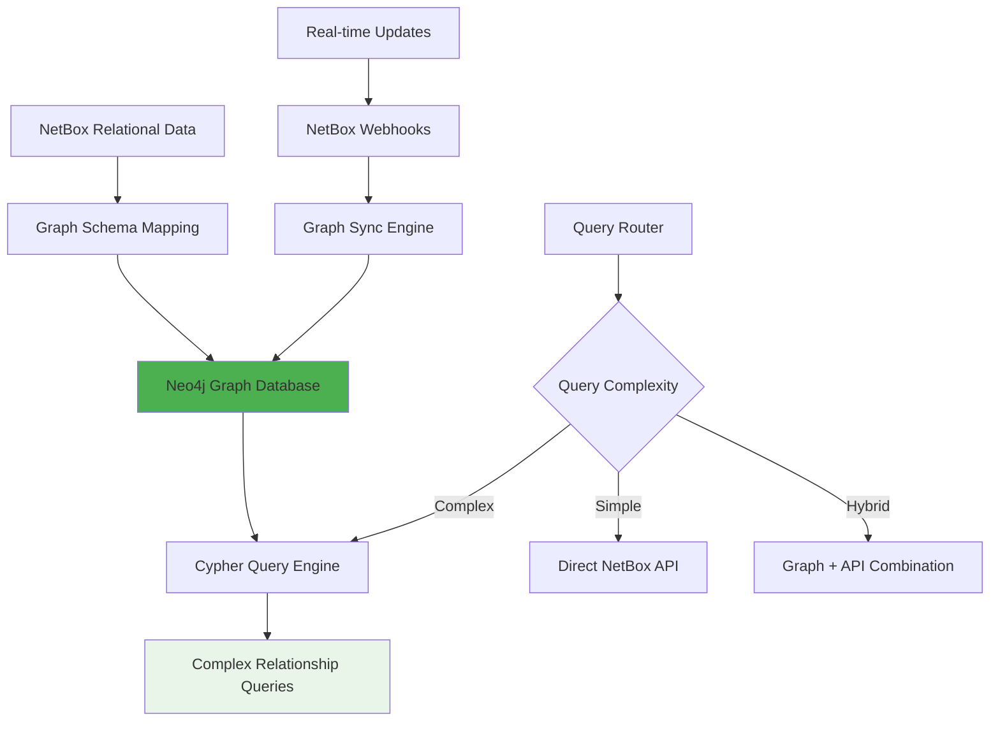

# Phase 2: Neo4j Graph Database Integration

## Objective

Add pre-computed relationship intelligence using **Neo4j graph database** to enable instant complex queries while maintaining the reliable tool chain foundation as backup for edge cases.

## Strategic Approach

Transform network infrastructure data from relational tables into a **graph-first data model** that mirrors the physical reality of network relationships, enabling sub-second traversal of complex network topologies and dependencies.



## Schema Discovery & Design

### NetBox to Graph Schema Mapping

**Core Entity Types**:
```cypher
// Primary network entities
CREATE (s:Site {name: 'HQ-DC1', slug: 'hq-dc1'})
CREATE (r:Rack {name: 'A-01', position: 42})  
CREATE (d:Device {name: 'SW-CORE-01', device_type: 'Catalyst-9500'})
CREATE (i:Interface {name: 'GigE1/0/1', type: 'ethernet'})
CREATE (c:Cable {id: 'CAB-001', type: 'cat6'})
CREATE (v:VLAN {vid: 100, name: 'Production'})
CREATE (ip:IPAddress {address: '192.168.100.1/24'})

// Hierarchical relationships
CREATE (s)-[:CONTAINS]->(r)
CREATE (r)-[:HOUSES]->(d)  
CREATE (d)-[:HAS_INTERFACE]->(i)

// Network connectivity
CREATE (i)-[:CONNECTED_VIA]->(c)
CREATE (c)-[:TERMINATES_AT]->(i2:Interface)
CREATE (i)-[:MEMBER_OF]->(v)
CREATE (i)-[:ASSIGNED_IP]->(ip)

// Logical relationships
CREATE (v)-[:SPANS_DEVICE]->(d)
CREATE (ip)-[:ALLOCATED_TO]->(d)
```

### Relationship Pattern Analysis

**Identified Key Patterns**:
```cypher
// Device-to-device connectivity (Layer 1)
MATCH (d1:Device)-[:HAS_INTERFACE]->(i1:Interface)-[:CONNECTED_VIA]->
      (c:Cable)<-[:CONNECTED_VIA]-(i2:Interface)<-[:HAS_INTERFACE]-(d2:Device)
RETURN d1.name, d2.name, c.type

// VLAN spanning analysis (Layer 2)  
MATCH (v:VLAN)-[:SPANS_DEVICE]->(d:Device)
RETURN v.name, count(d) as device_count, collect(d.name) as devices

// IP subnet utilization (Layer 3)
MATCH (subnet:Prefix)-[:CONTAINS_IP]->(ip:IPAddress)-[:ALLOCATED_TO]->(d:Device)
RETURN subnet.cidr, count(ip) as used_ips, collect(d.name) as devices

// Power dependency chains  
MATCH (d:Device)-[:POWERED_BY]->(outlet:PowerOutlet)-[:FED_BY]->
      (pdu:PDU)-[:CONNECTED_TO]->(ups:UPS)
RETURN d.name, pdu.name, ups.name
```

## Data Population Pipeline

### Initial Graph Construction

```python
import asyncio
from neo4j import AsyncGraphDatabase
from netbox_client import NetBoxAPI

class GraphPopulationEngine:
    def __init__(self, neo4j_uri: str, netbox_client: NetBoxAPI):
        self.driver = AsyncGraphDatabase.driver(neo4j_uri, auth=('neo4j', 'password'))
        self.netbox = netbox_client
        
    async def populate_initial_graph(self):
        """
        Parallel extraction and graph population from NetBox
        """
        # Extract all entity types concurrently
        extraction_tasks = [
            self.extract_sites(),
            self.extract_devices(), 
            self.extract_interfaces(),
            self.extract_cables(),
            self.extract_vlans(),
            self.extract_ip_addresses(),
            self.extract_power_infrastructure()
        ]
        
        extracted_data = await asyncio.gather(*extraction_tasks)
        
        # Build graph in dependency order
        async with self.driver.session() as session:
            await session.execute_write(self.create_sites, extracted_data[0])
            await session.execute_write(self.create_devices, extracted_data[1])
            await session.execute_write(self.create_interfaces, extracted_data[2])
            await session.execute_write(self.create_relationships, extracted_data)
            
        print("Initial graph population completed")
        
    async def create_devices(self, tx, devices_data):
        """
        Batch create device nodes with properties
        """
        cypher = """
        UNWIND $devices as device
        CREATE (d:Device {
            id: device.id,
            name: device.name,
            device_type: device.device_type.model,
            serial: device.serial,
            status: device.status.value,
            site_id: device.site.id,
            rack_id: device.rack.id
        })
        """
        await tx.run(cypher, devices=devices_data)
        
    async def create_relationships(self, tx, all_data):
        """
        Create relationships between entities in batch operations
        """
        # Site -> Device relationships
        site_device_cypher = """
        MATCH (s:Site {id: $site_id})
        MATCH (d:Device {site_id: $site_id})
        CREATE (s)-[:CONTAINS]->(d)
        """
        
        # Interface -> Device relationships  
        interface_device_cypher = """
        MATCH (d:Device {id: $device_id})
        MATCH (i:Interface {device_id: $device_id})
        CREATE (d)-[:HAS_INTERFACE]->(i)
        """
        
        # Cable connections (most complex)
        cable_connection_cypher = """
        MATCH (c:Cable {id: $cable_id})
        MATCH (i1:Interface {id: $termination_a_id})
        MATCH (i2:Interface {id: $termination_b_id})
        CREATE (i1)-[:CONNECTED_VIA]->(c)<-[:CONNECTED_VIA]-(i2)
        """
        
        # Execute relationship creation in parallel where possible
        relationship_tasks = [
            tx.run(site_device_cypher, site_id=site_id)
            for site_id in extract_site_ids(all_data)
        ]
        
        await asyncio.gather(*relationship_tasks)
```

### Data Quality Assurance

```cypher
// Constraint definitions for data integrity
CREATE CONSTRAINT device_name_unique FOR (d:Device) REQUIRE d.name IS UNIQUE;
CREATE CONSTRAINT interface_device_interface_unique FOR (i:Interface) REQUIRE (i.device_id, i.name) IS UNIQUE;
CREATE CONSTRAINT cable_id_unique FOR (c:Cable) REQUIRE c.id IS UNIQUE;

// Data validation queries
// Find devices without sites (orphaned devices)
MATCH (d:Device) 
WHERE NOT (d)<-[:CONTAINS]-(:Site)
RETURN d.name, d.id

// Find cables with missing terminations
MATCH (c:Cable)
WHERE NOT (c)-[:TERMINATES_AT]->(:Interface)
RETURN c.id, c.label

// Find IP addresses without device assignments
MATCH (ip:IPAddress)
WHERE NOT (ip)-[:ALLOCATED_TO]->(:Device)
RETURN ip.address, ip.status
```

## Graph Query Capabilities

### Complex Relationship Queries

**Network Path Discovery**:
```cypher
// Find all possible paths between two devices
MATCH path = (d1:Device {name: 'SW-ACCESS-01'})-[*1..5]-(d2:Device {name: 'RTR-CORE-01'})
WHERE ALL(r in relationships(path) WHERE type(r) IN ['CONNECTED_VIA', 'HAS_INTERFACE'])
RETURN path, length(path) as hop_count
ORDER BY hop_count ASC
LIMIT 5
```

**Impact Analysis**:
```cypher
// Find all devices affected if a specific device fails
MATCH (failed:Device {name: 'SW-CORE-01'})
MATCH (affected:Device)-[*1..3]-(failed)
WHERE affected <> failed
RETURN DISTINCT affected.name, affected.device_type, 
       shortestPath((affected)-[*]-(failed)) as dependency_path
```

**VLAN Topology Mapping**:
```cypher
// Complete VLAN 100 topology with device interconnections
MATCH (v:VLAN {vid: 100})-[:SPANS_DEVICE]->(d:Device)
OPTIONAL MATCH (d)-[:HAS_INTERFACE]->(i:Interface)-[:MEMBER_OF]->(v)
OPTIONAL MATCH (i)-[:CONNECTED_VIA]->(c:Cable)<-[:CONNECTED_VIA]-(i2:Interface)
OPTIONAL MATCH (i2)<-[:HAS_INTERFACE]-(d2:Device)
WHERE (v)-[:SPANS_DEVICE]->(d2)
RETURN v.name, 
       collect(DISTINCT d.name) as vlan_devices,
       collect(DISTINCT {
           from_device: d.name,
           from_interface: i.name,
           to_device: d2.name, 
           to_interface: i2.name,
           cable: c.id
       }) as inter_device_connections
```

### Advanced Analytical Queries

**Capacity Planning Analysis**:
```cypher
// Site utilization analysis with growth projections
MATCH (s:Site)-[:CONTAINS]->(r:Rack)-[:HOUSES]->(d:Device)
WITH s, r, count(d) as device_count, r.u_height as total_units
MATCH (r)-[:HOUSES]->(d2:Device)
WITH s, r, device_count, total_units, sum(d2.device_type.u_height) as used_units
RETURN s.name,
       count(r) as total_racks,
       sum(used_units) as total_used_units,
       sum(total_units) as total_available_units,
       round(100.0 * sum(used_units) / sum(total_units), 2) as utilization_percent,
       sum(total_units) - sum(used_units) as available_capacity
ORDER BY utilization_percent DESC
```

**Single Point of Failure Detection**:
```cypher
// Find critical devices whose failure would isolate other devices
MATCH (critical:Device)
WHERE EXISTS {
    MATCH (isolated:Device)-[*1..2]-(critical)
    WHERE isolated <> critical
    AND NOT EXISTS {
        MATCH (isolated)-[*1..3]-(alternate:Device)-[*1..2]-(target:Device)
        WHERE target <> critical 
        AND target <> isolated
        AND alternate <> critical
        AND alternate <> isolated
    }
}
RETURN critical.name, critical.device_type,
       [(critical)-[*1..2]-(dependent) WHERE dependent <> critical | dependent.name] as dependent_devices
```

## Synchronization System

### Real-time Updates via NetBox Webhooks

```python
from fastapi import FastAPI, BackgroundTasks
from neo4j import AsyncGraphDatabase
import json

app = FastAPI()

class GraphSyncEngine:
    def __init__(self, neo4j_uri: str):
        self.driver = AsyncGraphDatabase.driver(neo4j_uri)
        
    async def handle_webhook_event(self, event_type: str, object_type: str, 
                                 data: dict, snapshot: dict):
        """
        Process NetBox webhook events and sync to graph
        """
        handler_map = {
            ('created', 'device'): self.handle_device_created,
            ('updated', 'device'): self.handle_device_updated, 
            ('deleted', 'device'): self.handle_device_deleted,
            ('created', 'cable'): self.handle_cable_created,
            ('deleted', 'cable'): self.handle_cable_deleted,
        }
        
        handler = handler_map.get((event_type, object_type))
        if handler:
            await handler(data, snapshot)
        else:
            print(f"Unhandled webhook: {event_type} {object_type}")
            
    async def handle_device_created(self, data: dict, snapshot: dict):
        """
        Add new device to graph with relationships
        """
        async with self.driver.session() as session:
            # Create device node
            await session.execute_write(self.create_device_node, data)
            
            # Create site relationship if site exists
            if data.get('site'):
                await session.execute_write(self.link_device_to_site, 
                                          data['id'], data['site']['id'])
                                          
            # Create rack relationship if rack assigned
            if data.get('rack'):
                await session.execute_write(self.link_device_to_rack,
                                          data['id'], data['rack']['id'])
    
    async def handle_cable_created(self, data: dict, snapshot: dict):
        """
        Add cable with termination relationships
        """
        async with self.driver.session() as session:
            cypher = """
            CREATE (c:Cable {
                id: $cable_id,
                label: $label,
                type: $cable_type,
                length: $length,
                status: $status
            })
            
            WITH c
            MATCH (i1:Interface {id: $term_a_id})
            MATCH (i2:Interface {id: $term_b_id})
            CREATE (i1)-[:CONNECTED_VIA]->(c)<-[:CONNECTED_VIA]-(i2)
            """
            
            await session.execute_write(
                lambda tx: tx.run(cypher, 
                    cable_id=data['id'],
                    label=data.get('label', ''),
                    cable_type=data.get('type', {}).get('name', ''),
                    length=data.get('length'),
                    status=data.get('status', {}).get('value', ''),
                    term_a_id=data['a_terminations'][0]['object_id'],
                    term_b_id=data['b_terminations'][0]['object_id']
                )
            )

sync_engine = GraphSyncEngine("bolt://localhost:7687")

@app.post("/netbox-webhook")
async def netbox_webhook(webhook_data: dict, background_tasks: BackgroundTasks):
    """
    Receive NetBox webhook and queue graph sync
    """
    background_tasks.add_task(
        sync_engine.handle_webhook_event,
        webhook_data['event'],
        webhook_data['model'],  
        webhook_data['data'],
        webhook_data['snapshots']
    )
    
    return {"status": "accepted"}
```

### Batch Synchronization Safety Net

```python
import schedule
import time
from datetime import datetime, timedelta

class GraphConsistencyChecker:
    def __init__(self, netbox_client, neo4j_driver):
        self.netbox = netbox_client
        self.driver = neo4j_driver
        
    async def daily_consistency_check(self):
        """
        Compare NetBox and Neo4j data for inconsistencies
        """
        print(f"Starting consistency check at {datetime.now()}")
        
        inconsistencies = []
        
        # Check device count consistency
        netbox_device_count = len(await self.netbox.dcim.devices.all())
        
        async with self.driver.session() as session:
            neo4j_result = await session.run("MATCH (d:Device) RETURN count(d) as device_count")
            neo4j_device_count = (await neo4j_result.single())['device_count']
            
        if netbox_device_count != neo4j_device_count:
            inconsistencies.append({
                'type': 'device_count_mismatch',
                'netbox_count': netbox_device_count,
                'neo4j_count': neo4j_device_count,
                'severity': 'high'
            })
            
        # Check for orphaned relationships
        async with self.driver.session() as session:
            orphaned_query = """
            MATCH (c:Cable)-[:CONNECTED_VIA]-(i:Interface)
            WHERE NOT EXISTS {
                MATCH (i)<-[:HAS_INTERFACE]-(:Device)
            }
            RETURN count(DISTINCT c) as orphaned_cables
            """
            orphaned_result = await session.run(orphaned_query)
            orphaned_count = (await orphaned_result.single())['orphaned_cables']
            
        if orphaned_count > 0:
            inconsistencies.append({
                'type': 'orphaned_cable_relationships',
                'count': orphaned_count,
                'severity': 'medium'
            })
            
        if inconsistencies:
            await self.handle_inconsistencies(inconsistencies)
        else:
            print("Graph consistency check passed")
            
    async def handle_inconsistencies(self, inconsistencies):
        """
        Handle detected inconsistencies with automated repair
        """
        for issue in inconsistencies:
            if issue['severity'] == 'high':
                print(f"CRITICAL: {issue}")
                await self.trigger_full_resync()
            else:
                print(f"WARNING: {issue}")
                await self.repair_specific_issue(issue)

# Schedule daily consistency checks
schedule.every().day.at("02:00").do(lambda: asyncio.run(
    GraphConsistencyChecker(netbox_client, neo4j_driver).daily_consistency_check()
))
```

## Hybrid System Integration

### Smart Query Routing

```python
class HybridQueryRouter:
    def __init__(self, neo4j_driver, netbox_client):
        self.graph_db = neo4j_driver
        self.netbox = netbox_client
        self.performance_tracker = QueryPerformanceTracker()
        
    async def route_query(self, classified_intent: Dict[str, Any]) -> ExecutionStrategy:
        """
        Decide whether to use graph database or direct API calls
        """
        query_characteristics = self.analyze_query_characteristics(classified_intent)
        
        # Graph database is optimal for:
        if (query_characteristics['relationship_depth'] > 2 or
            query_characteristics['involves_path_finding'] or
            query_characteristics['requires_aggregation'] or
            query_characteristics['involves_multiple_object_types'] > 3):
            
            # Check graph data freshness
            graph_freshness = await self.check_graph_freshness(classified_intent['target_objects'])
            
            if graph_freshness['is_acceptable']:
                return ExecutionStrategy(
                    primary='neo4j_graph',
                    fallback='netbox_api',
                    estimated_performance='sub_second'
                )
            else:
                return ExecutionStrategy(
                    primary='hybrid_refresh',
                    steps=['refresh_graph_subset', 'execute_graph_query'],
                    estimated_performance='fast'
                )
        
        # Direct API is better for:
        elif (query_characteristics['single_object_lookup'] or
              query_characteristics['requires_realtime_data'] or
              query_characteristics['simple_list_query']):
            
            return ExecutionStrategy(
                primary='netbox_api',
                optimization='use_cache',
                estimated_performance='fast'
            )
        
        # Hybrid approach for complex edge cases
        else:
            return ExecutionStrategy(
                primary='hybrid_combination',
                steps=['graph_analysis', 'api_enrichment', 'combine_results'],
                estimated_performance='moderate'
            )
            
    async def execute_graph_query(self, cypher_query: str, parameters: dict) -> dict:
        """
        Execute Cypher query with performance monitoring
        """
        start_time = time.time()
        
        async with self.graph_db.session() as session:
            result = await session.run(cypher_query, parameters)
            data = await result.data()
            
        execution_time = time.time() - start_time
        
        self.performance_tracker.record_query_performance(
            query_type='graph',
            execution_time=execution_time,
            result_count=len(data)
        )
        
        return {
            'data': data,
            'execution_time': execution_time,
            'source': 'neo4j_graph',
            'cache_eligible': True
        }
```

## Performance Optimization

### Query Performance Tuning

```cypher
-- Create indexes for common query patterns
CREATE INDEX device_name_idx FOR (d:Device) ON (d.name);
CREATE INDEX interface_device_idx FOR (i:Interface) ON (i.device_id);
CREATE INDEX vlan_vid_idx FOR (v:VLAN) ON (v.vid);
CREATE INDEX cable_termination_idx FOR (c:Cable) ON (c.termination_a_id, c.termination_b_id);

-- Composite indexes for complex queries
CREATE INDEX device_site_type_idx FOR (d:Device) ON (d.site_id, d.device_type);
CREATE INDEX interface_vlan_idx FOR (i:Interface) ON (i.device_id, i.vlan_memberships);
```

**Query Optimization Examples**:
```cypher
-- BEFORE: Inefficient path finding (takes 30+ seconds)
MATCH path = (d1:Device {name: 'SW-001'})-[*]-(d2:Device {name: 'RTR-001'})
RETURN path

-- AFTER: Optimized with direction and relationship type constraints (< 1 second)
MATCH path = (d1:Device {name: 'SW-001'})-[:HAS_INTERFACE]->
             (:Interface)-[:CONNECTED_VIA*1..5]-
             (:Interface)<-[:HAS_INTERFACE]-(d2:Device {name: 'RTR-001'})
RETURN path
LIMIT 1
```

## Success Metrics

### Performance Targets
- **Relationship queries**: Complete in under 1 second using graph traversal
- **Complex infrastructure audits**: Complete in under 3 seconds using optimized Cypher
- **Graph synchronization**: Stay within 5 minutes of NetBox state using webhooks  
- **Query success rate**: Handle previously impossible multi-hop relationship queries

### Technical Metrics
- **Graph database size**: Efficiently store 10K+ devices, 100K+ interfaces, 50K+ cables
- **Sync reliability**: 99.9% webhook processing success rate
- **Memory usage**: Graph database footprint under 4GB for typical enterprise deployment
- **Concurrent query performance**: Support 50+ concurrent users without degradation

### User Experience Impact
- **New query capabilities**: Enable questions previously impossible with relational approaches
- **Response time consistency**: Eliminate variable performance based on relationship complexity
- **Visual topology**: Support for graph visualization and network mapping tools
- **Predictable performance**: Sub-second response times regardless of network size

This graph integration phase transforms the system from a basic API interface into a true **network topology intelligence platform** capable of answering sophisticated infrastructure questions in real-time.