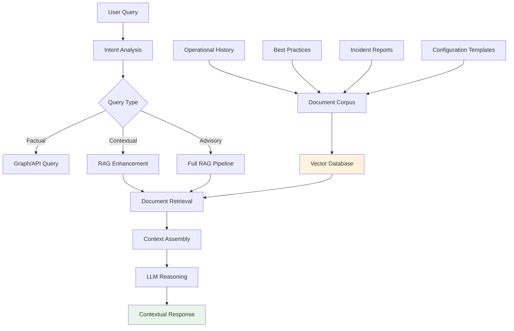

# Phase 3: RAG-Powered Semantic Intelligence

## Objective

Add **Retrieval-Augmented Generation** capabilities to provide semantic understanding, institutional memory, and contextual recommendations based on operational documentation, historical patterns, and organizational knowledge.

## Strategic Vision

Transform the system from a network data interface into an **organizational infrastructure advisor** that combines structured NetBox data with unstructured operational knowledge to provide expert-level guidance and recommendations.



## Document Corpus Development

### Operational Knowledge Ingestion

**Target Document Types**:
```python
class OperationalDocumentTypes:
    RUNBOOKS = {
        'examples': ['Network Maintenance Procedures', 'Emergency Response Plans'],
        'value': 'Step-by-step operational guidance',
        'update_frequency': 'quarterly'
    }
    
    INCIDENT_REPORTS = {
        'examples': ['Post-mortem analyses', 'RCA documentation'],
        'value': 'Historical problem resolution patterns',
        'update_frequency': 'continuous'
    }
    
    CONFIGURATION_STANDARDS = {
        'examples': ['Device templates', 'Security policies'],
        'value': 'Compliance and best practice enforcement',
        'update_frequency': 'monthly'
    }
    
    VENDOR_DOCUMENTATION = {
        'examples': ['Device manuals', 'Troubleshooting guides'],
        'value': 'Technical reference and procedures',
        'update_frequency': 'as_released'
    }
    
    CHANGE_RECORDS = {
        'examples': ['Change requests', 'Implementation logs'],
        'value': 'Change impact analysis and rollback procedures',
        'update_frequency': 'continuous'
    }
```

### Document Processing Pipeline

```python
import asyncio
from pathlib import Path
from langchain.document_loaders import (
    PDFLoader, MarkdownLoader, ConfluenceLoader, SharePointLoader
)
from langchain.text_splitter import RecursiveCharacterTextSplitter
from langchain.embeddings import OpenAIEmbeddings
from langchain.vectorstores import Chroma

class DocumentProcessingPipeline:
    def __init__(self, vector_store_path: str):
        self.embeddings = OpenAIEmbeddings(model="text-embedding-3-large")
        self.vector_store = Chroma(
            persist_directory=vector_store_path,
            embedding_function=self.embeddings
        )
        
        # Specialized text splitters for different document types
        self.splitters = {
            'runbook': RecursiveCharacterTextSplitter(
                chunk_size=1000,
                chunk_overlap=200,
                separators=["\n## ", "\n### ", "\n\n", "\n", " "]
            ),
            'incident': RecursiveCharacterTextSplitter(
                chunk_size=800,
                chunk_overlap=150,
                separators=["Problem:", "Solution:", "Root Cause:", "\n\n"]
            ),
            'configuration': RecursiveCharacterTextSplitter(
                chunk_size=600,
                chunk_overlap=100,
                separators=["interface ", "vlan ", "router ", "\n"]
            )
        }
    
    async def process_document_batch(self, document_paths: List[Path],
                                   document_type: str) -> int:
        """
        Process multiple documents concurrently with type-specific handling
        """
        processing_tasks = [
            self.process_single_document(doc_path, document_type)
            for doc_path in document_paths
        ]
        
        processed_chunks = await asyncio.gather(*processing_tasks)
        total_chunks = sum(len(chunks) for chunks in processed_chunks if chunks)
        
        print(f"Processed {len(document_paths)} {document_type} documents -> {total_chunks} chunks")
        return total_chunks
    
    async def process_single_document(self, doc_path: Path, 
                                    document_type: str) -> List[Document]:
        """
        Process individual document with metadata enrichment
        """
        # Load document with appropriate loader
        loader_map = {
            '.pdf': PDFLoader,
            '.md': MarkdownLoader,
            '.txt': TextLoader
        }
        
        loader_class = loader_map.get(doc_path.suffix, TextLoader)
        loader = loader_class(str(doc_path))
        
        try:
            documents = loader.load()
        except Exception as e:
            print(f"Failed to load {doc_path}: {e}")
            return []
        
        # Apply type-specific text splitting
        splitter = self.splitters.get(document_type, self.splitters['runbook'])
        chunks = splitter.split_documents(documents)
        
        # Enrich metadata
        for chunk in chunks:
            chunk.metadata.update({
                'document_type': document_type,
                'source_file': str(doc_path),
                'processed_date': datetime.utcnow().isoformat(),
                'chunk_index': chunks.index(chunk),
                'estimated_tokens': len(chunk.page_content) // 4
            })
            
            # Add domain-specific metadata
            if document_type == 'incident':
                chunk.metadata.update(
                    self.extract_incident_metadata(chunk.page_content)
                )
            elif document_type == 'configuration':
                chunk.metadata.update(
                    self.extract_config_metadata(chunk.page_content)
                )
        
        # Add to vector store
        self.vector_store.add_documents(chunks)
        
        return chunks
    
    def extract_incident_metadata(self, content: str) -> Dict[str, Any]:
        """
        Extract incident-specific metadata for better retrieval
        """
        metadata = {}
        
        # Extract severity if mentioned
        severity_patterns = {
            r'severity[:\s]+critical': 'critical',
            r'severity[:\s]+high': 'high', 
            r'severity[:\s]+medium': 'medium',
            r'severity[:\s]+low': 'low'
        }
        
        for pattern, level in severity_patterns.items():
            if re.search(pattern, content, re.IGNORECASE):
                metadata['incident_severity'] = level
                break
                
        # Extract affected systems
        system_patterns = [
            r'affected\s+system[s]?[:\s]+([^\n]+)',
            r'impacted\s+device[s]?[:\s]+([^\n]+)',
            r'failed\s+component[s]?[:\s]+([^\n]+)'
        ]
        
        for pattern in system_patterns:
            match = re.search(pattern, content, re.IGNORECASE)
            if match:
                metadata['affected_systems'] = match.group(1).strip()
                break
        
        return metadata
```

### Semantic Search Integration

```python
from langchain.retrievers import ContextualCompressionRetriever
from langchain.retrievers.document_compressors import LLMChainExtractor

class NetworkKnowledgeRetriever:
    def __init__(self, vector_store, llm):
        self.vector_store = vector_store
        self.llm = llm
        
        # Base retriever with semantic similarity
        self.base_retriever = vector_store.as_retriever(
            search_type="mmr",  # Maximal Marginal Relevance for diversity
            search_kwargs={
                'k': 10,  # Retrieve more candidates initially
                'fetch_k': 20,
                'lambda_mult': 0.7  # Balance relevance vs diversity
            }
        )
        
        # Contextual compression to filter irrelevant chunks
        compressor = LLMChainExtractor.from_llm(llm)
        self.compressed_retriever = ContextualCompressionRetriever(
            base_compressor=compressor,
            base_retriever=self.base_retriever
        )
    
    async def retrieve_relevant_context(self, query: str, 
                                      query_type: str,
                                      max_contexts: int = 5) -> List[Document]:
        """
        Retrieve and rank relevant documents based on query context
        """
        # Expand query with domain-specific terms
        expanded_query = self.expand_query_with_context(query, query_type)
        
        # Retrieve initial candidates
        candidates = await self.compressed_retriever.aretrieve(expanded_query)
        
        # Apply domain-specific filtering and ranking
        filtered_candidates = self.apply_domain_filters(candidates, query_type)
        
        # Re-rank based on multiple factors
        ranked_results = self.rerank_by_relevance(filtered_candidates, query)
        
        return ranked_results[:max_contexts]
    
    def expand_query_with_context(self, query: str, query_type: str) -> str:
        """
        Add contextual terms to improve retrieval accuracy
        """
        context_expansions = {
            'troubleshooting': ['problem', 'issue', 'failure', 'resolution', 'fix'],
            'configuration': ['config', 'setup', 'template', 'standard', 'policy'],
            'maintenance': ['procedure', 'steps', 'checklist', 'schedule'],
            'planning': ['capacity', 'growth', 'upgrade', 'expansion']
        }
        
        expansion_terms = context_expansions.get(query_type, [])
        if expansion_terms:
            expanded = f"{query} {' '.join(expansion_terms[:3])}"
            return expanded
        
        return query
    
    def rerank_by_relevance(self, documents: List[Document], 
                          original_query: str) -> List[Document]:
        """
        Re-rank documents using multiple relevance signals
        """
        scored_docs = []
        
        for doc in documents:
            score = 0
            
            # Base similarity score (from vector search)
            score += doc.metadata.get('relevance_score', 0) * 0.4
            
            # Document type relevance
            doc_type = doc.metadata.get('document_type', '')
            if 'incident' in doc_type and 'problem' in original_query.lower():
                score += 0.2
            if 'runbook' in doc_type and ('how' in original_query.lower() or 
                                         'procedure' in original_query.lower()):
                score += 0.2
            
            # Freshness score (recent documents slightly preferred)
            processed_date = doc.metadata.get('processed_date', '')
            if processed_date:
                age_days = (datetime.utcnow() - 
                           datetime.fromisoformat(processed_date)).days
                freshness_score = max(0, (365 - age_days) / 365 * 0.1)
                score += freshness_score
            
            # Content quality indicators
            content_length = len(doc.page_content)
            if 200 <= content_length <= 2000:  # Optimal chunk size
                score += 0.1
            
            scored_docs.append((doc, score))
        
        # Sort by score descending
        scored_docs.sort(key=lambda x: x[1], reverse=True)
        
        return [doc for doc, score in scored_docs]
```

## Contextual Intelligence Development

### Operational Pattern Recognition

```python
class OperationalPatternAnalyzer:
    def __init__(self, vector_store, graph_db):
        self.vector_store = vector_store
        self.graph_db = graph_db
        self.pattern_cache = {}
    
    async def analyze_query_for_patterns(self, user_query: str,
                                       current_context: Dict[str, Any]) -> Dict[str, Any]:
        """
        Identify patterns in current query based on historical data
        """
        # Search for similar historical queries/incidents
        similar_cases = await self.find_similar_historical_cases(user_query)
        
        # Analyze current network state for known pattern indicators
        network_state = await self.assess_current_network_state(current_context)
        
        # Generate predictive insights
        predictions = await self.generate_predictive_insights(
            similar_cases, network_state, user_query
        )
        
        return {
            'similar_cases': similar_cases,
            'current_patterns': network_state,
            'predictions': predictions,
            'recommended_actions': self.generate_action_recommendations(predictions)
        }
    
    async def find_similar_historical_cases(self, query: str) -> List[Dict[str, Any]]:
        """
        Find similar incidents/situations from historical data
        """
        # Search incident reports for similar problems
        incident_query = f"similar issue problem: {query}"
        incident_docs = await self.vector_store.asimilarity_search(
            incident_query,
            filter={'document_type': 'incident'},
            k=5
        )
        
        cases = []
        for doc in incident_docs:
            case = {
                'title': doc.metadata.get('title', 'Historical Incident'),
                'severity': doc.metadata.get('incident_severity', 'unknown'),
                'affected_systems': doc.metadata.get('affected_systems', ''),
                'resolution': self.extract_resolution_summary(doc.page_content),
                'relevance_score': doc.metadata.get('relevance_score', 0)
            }
            cases.append(case)
        
        return cases
    
    def generate_action_recommendations(self, predictions: Dict[str, Any]) -> List[str]:
        """
        Generate actionable recommendations based on pattern analysis
        """
        recommendations = []
        
        if predictions.get('risk_level', 'low') == 'high':
            recommendations.extend([
                "Consider scheduling maintenance window for affected systems",
                "Review recent changes that might have contributed to this pattern",
                "Verify backup systems are operational"
            ])
        
        if predictions.get('capacity_concern', False):
            recommendations.extend([
                "Plan capacity expansion for identified bottlenecks",
                "Review utilization trends over past 30 days",
                "Consider load balancing adjustments"
            ])
        
        if predictions.get('configuration_drift', False):
            recommendations.extend([
                "Audit current configurations against approved standards",
                "Schedule configuration backup and verification",
                "Review change approval processes"
            ])
        
        return recommendations
```

### Institutional Memory Integration

```python
class InstitutionalMemoryEngine:
    def __init__(self, vector_store, graph_db, llm):
        self.vector_store = vector_store
        self.graph_db = graph_db
        self.llm = llm
        self.expertise_mapping = {}
    
    async def enhance_query_with_institutional_knowledge(self,
                                                       query: str,
                                                       context: Dict[str, Any]) -> str:
        """
        Add organizational context and historical knowledge to queries
        """
        # Retrieve organizational policies and standards
        policy_context = await self.get_relevant_policies(query)
        
        # Find historical decisions and their rationale
        decision_history = await self.get_decision_history(query, context)
        
        # Identify subject matter experts for this area
        experts = await self.identify_relevant_experts(query)
        
        # Build enriched context
        enhanced_context = f"""
        Original Query: {query}
        
        Organizational Context:
        {policy_context}
        
        Historical Decisions:
        {decision_history}
        
        Subject Matter Expertise:
        {experts}
        
        Please provide a response that considers our organizational standards,
        historical context, and available expertise.
        """
        
        return enhanced_context
    
    async def get_relevant_policies(self, query: str) -> str:
        """
        Retrieve applicable organizational policies and standards
        """
        policy_docs = await self.vector_store.asimilarity_search(
            query,
            filter={'document_type': 'policy'},
            k=3
        )
        
        if not policy_docs:
            return "No specific organizational policies found for this area."
        
        policy_summary = []
        for doc in policy_docs:
            policy_summary.append(f"- {doc.metadata.get('title', 'Policy')}: {doc.page_content[:200]}...")
        
        return "\n".join(policy_summary)
    
    async def get_decision_history(self, query: str, 
                                 context: Dict[str, Any]) -> str:
        """
        Find historical decisions related to current query context
        """
        # Search change records and decision documents
        decision_query = f"decision rationale choice: {query}"
        decision_docs = await self.vector_store.asimilarity_search(
            decision_query,
            filter={'document_type': 'change_record'},
            k=3
        )
        
        if not decision_docs:
            return "No relevant historical decisions found."
        
        decisions = []
        for doc in decision_docs:
            decision = {
                'date': doc.metadata.get('date', 'Unknown'),
                'summary': doc.page_content[:300],
                'outcome': self.extract_decision_outcome(doc.page_content)
            }
            decisions.append(f"- {decision['date']}: {decision['outcome']}")
        
        return "\n".join(decisions) if decisions else "No relevant decisions found."
```

## Advanced RAG Capabilities

### Multi-Modal Knowledge Integration

```python
class MultiModalKnowledgeIntegrator:
    def __init__(self, vector_store, graph_db, netbox_client, llm):
        self.vector_store = vector_store
        self.graph_db = graph_db
        self.netbox = netbox_client
        self.llm = llm
    
    async def create_comprehensive_response(self, query: str) -> Dict[str, Any]:
        """
        Integrate structured data, graph relationships, and document knowledge
        """
        # Parallel data gathering
        structured_data_task = self.get_structured_data(query)
        graph_analysis_task = self.get_graph_insights(query)
        document_context_task = self.get_document_context(query)
        
        structured_data, graph_insights, doc_context = await asyncio.gather(
            structured_data_task,
            graph_analysis_task, 
            document_context_task
        )
        
        # Synthesize comprehensive response
        synthesis_prompt = f"""
        Based on the following information sources, provide a comprehensive answer to: {query}
        
        STRUCTURED DATA:
        {json.dumps(structured_data, indent=2)}
        
        NETWORK RELATIONSHIPS:
        {graph_insights}
        
        OPERATIONAL KNOWLEDGE:
        {doc_context}
        
        Please provide:
        1. Direct answer to the question
        2. Relevant context and implications
        3. Recommended next steps
        4. Potential risks or considerations
        5. Related best practices from our documentation
        """
        
        response = await self.llm.agenerate([synthesis_prompt])
        
        return {
            'answer': response.generations[0][0].text,
            'data_sources': {
                'structured': bool(structured_data),
                'relationships': bool(graph_insights),
                'documentation': bool(doc_context)
            },
            'confidence_level': self.calculate_confidence_level(
                structured_data, graph_insights, doc_context
            )
        }
    
    def calculate_confidence_level(self, structured_data, graph_insights, doc_context) -> str:
        """
        Assess confidence in response based on data availability
        """
        data_sources = sum([
            1 if structured_data else 0,
            1 if graph_insights else 0,
            1 if doc_context else 0
        ])
        
        if data_sources >= 3:
            return "high"
        elif data_sources >= 2:
            return "medium"
        elif data_sources >= 1:
            return "low"
        else:
            return "insufficient_data"
```

### Conversational Context Enhancement

```python
class ConversationalContextManager:
    def __init__(self, session_store):
        self.session_store = session_store
        self.context_window_size = 10  # Remember last 10 interactions
        
    async def enhance_query_with_conversation_history(self,
                                                    query: str,
                                                    session_id: str) -> str:
        """
        Add conversational context to improve query understanding
        """
        # Retrieve conversation history
        history = await self.session_store.get_conversation_history(
            session_id, 
            limit=self.context_window_size
        )
        
        if not history:
            return query  # No context to add
        
        # Analyze conversation for ongoing topics
        ongoing_topics = self.identify_ongoing_topics(history)
        previous_entities = self.extract_mentioned_entities(history)
        
        # Build contextual query enhancement
        context_enhancement = []
        
        if ongoing_topics:
            context_enhancement.append(f"Continuing discussion about: {', '.join(ongoing_topics)}")
        
        if previous_entities:
            context_enhancement.append(f"Previously mentioned: {', '.join(previous_entities)}")
        
        if context_enhancement:
            enhanced_query = f"""
            Context from conversation: {' | '.join(context_enhancement)}
            
            Current query: {query}
            
            Please consider the conversation context when responding.
            """
            return enhanced_query
        
        return query
    
    def identify_ongoing_topics(self, history: List[Dict[str, Any]]) -> List[str]:
        """
        Identify persistent topics in conversation history
        """
        topics = []
        topic_keywords = {
            'troubleshooting': ['problem', 'issue', 'error', 'failed', 'down'],
            'configuration': ['config', 'setup', 'configure', 'change'],
            'planning': ['plan', 'capacity', 'upgrade', 'expand'],
            'monitoring': ['status', 'health', 'utilization', 'performance']
        }
        
        recent_messages = [msg['content'] for msg in history[-5:]]  # Last 5 messages
        combined_text = ' '.join(recent_messages).lower()
        
        for topic, keywords in topic_keywords.items():
            if any(keyword in combined_text for keyword in keywords):
                topics.append(topic)
        
        return topics
```

## Production Integration & Optimization

### Performance Optimization Strategy

```python
class RAGPerformanceOptimizer:
    def __init__(self):
        self.query_cache = {}
        self.embedding_cache = {}
        self.performance_metrics = {}
        
    async def optimize_retrieval_performance(self, query: str) -> Dict[str, Any]:
        """
        Optimize RAG pipeline performance through intelligent caching and batching
        """
        # Check for cached embeddings
        query_embedding = await self.get_cached_embedding(query)
        
        if not query_embedding:
            query_embedding = await self.generate_and_cache_embedding(query)
        
        # Parallel retrieval from multiple sources
        retrieval_tasks = [
            self.retrieve_from_vector_store(query_embedding),
            self.retrieve_from_graph_context(query),
            self.retrieve_from_structured_data(query)
        ]
        
        retrieval_results = await asyncio.gather(*retrieval_tasks)
        
        # Intelligent result merging and deduplication
        merged_results = self.merge_and_deduplicate_results(retrieval_results)
        
        return merged_results
    
    async def get_cached_embedding(self, query: str) -> Optional[List[float]]:
        """
        Retrieve cached query embedding if available
        """
        # Use semantic similarity to find cached embeddings for similar queries
        query_hash = hashlib.md5(query.encode()).hexdigest()
        
        if query_hash in self.embedding_cache:
            return self.embedding_cache[query_hash]
        
        # Check for semantically similar cached queries
        for cached_query, cached_embedding in self.embedding_cache.items():
            similarity = self.calculate_query_similarity(query, cached_query)
            if similarity > 0.95:  # Very high similarity threshold
                return cached_embedding
        
        return None
```

## Success Metrics

### Technical Performance
- **Query enhancement accuracy**: 90%+ of queries benefit from RAG context
- **Response time**: RAG-enhanced queries complete within 5 seconds
- **Document retrieval precision**: 85%+ of retrieved documents rated as relevant
- **Context integration quality**: 95%+ of responses demonstrate proper context usage

### Business Value
- **Knowledge accessibility**: 80% reduction in time to find operational information
- **Decision quality**: Measurable improvement in infrastructure decisions through historical context
- **Training efficiency**: 60% reduction in time for new team members to become productive
- **Incident resolution**: 40% faster resolution through similar case pattern matching

### User Experience
- **Response relevance**: 90%+ of RAG-enhanced responses rated as more helpful than basic responses
- **Confidence indicators**: Clear indication of response confidence level based on available sources
- **Source transparency**: Users can trace recommendations back to source documents
- **Conversation continuity**: Maintains context across multi-turn conversations

This RAG integration phase transforms the system from a technical interface into a **knowledgeable infrastructure advisor** that combines the precision of structured data with the wisdom of organizational experience.