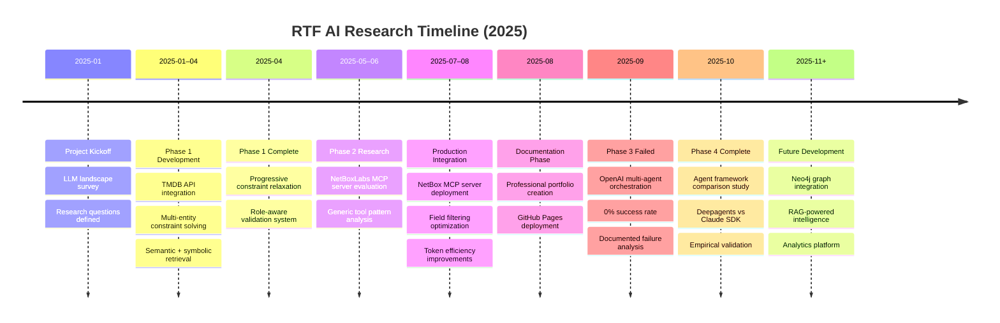
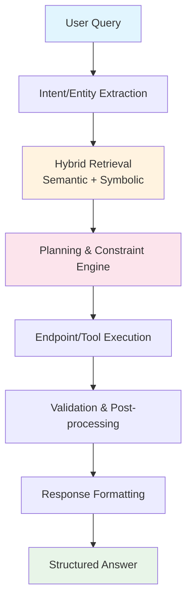

# RTF AI Research Portfolio

Welcome to the professional hub for **RTF AI research** into LLM-driven developer tooling, symbolic/semantic retrieval, and multi-step planning systems.

This portfolio demonstrates a structured research approach with reproducible demos, architecture decisions, and performance analysis across two comprehensive phases:

## Project Overview

- **Phase 1 – TMDB Chatbox**: Natural language movie/TV query system with multi-entity constraint solving, RAG API endpoint routing using ChromaDB, and progressive constraint relaxation
- **Phase 2 – NetBox MCP Server**: Official NetBoxLabs MCP server with 3 generic tools (get_objects, get_object_by_id, get_changelogs) providing shared infrastructure for agent frameworks
- **Phase 3 – OpenAI Orchestration (FAILED)**: Multi-agent orchestration attempt with 0% success rate - see ADR-0013 for failure analysis
- **Phase 4 – Agent Framework Comparison**: Empirical comparison of Deepagents (LangChain) vs Claude SDK approaches to building production NetBox agents

## Research Highlights

- **Hybrid Retrieval**: Combining semantic similarity with symbolic metadata filters for intelligent tool/endpoint selection
- **Performance Optimization**: Field filtering and generic tool patterns for token efficiency
- **Architecture Pattern**: Extraction → Retrieval → Planning → Execution → Validation → Formatting
- **Phase 4 Completion**: Empirical framework comparison validating context-dependent framework selection
- **Future Roadmap**: Neo4j graph integration (Phase 5), RAG intelligence (Phase 6), and analytics platform (Phase 7)

## Implementation Repositories

- **Phase 1**: [TMDB Chatbox](https://github.com/FinnMacCumail/tmdbGPT) - Natural language movie/TV query system
- **Phase 2**: [NetBoxLabs MCP Server](https://github.com/netboxlabs/netbox-mcp-server) - Official NetBox MCP server infrastructure
- **Phase 4A**: [Deepagents Implementation](https://github.com/FinnMacCumail/deepagents) - LangChain-based flexible framework
- **Phase 4B**: [Claude SDK Implementation](https://github.com/FinnMacCumail/claude-agentic-netbox) - Anthropic SDK production framework

## Research Timeline

## Core Architecture

The research demonstrates a consistent architectural pattern across both phases:

