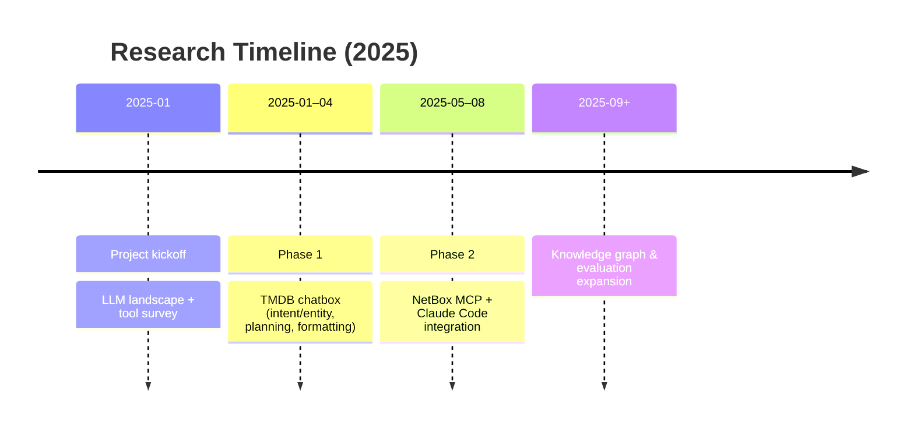

# AI Research Portfolio

Welcome! This site documents ongoing research into LLM-based planning, retrieval,
and developer tooling.

- **Phase 1 – TMDB Chatbox:** goals, architecture, techniques, and lessons learned.
- **Phase 2 – NetBox MCP + Claude Code:** integration design, MCP orchestration,
  pagination and knowledge-graph strategies.

## Timeline

