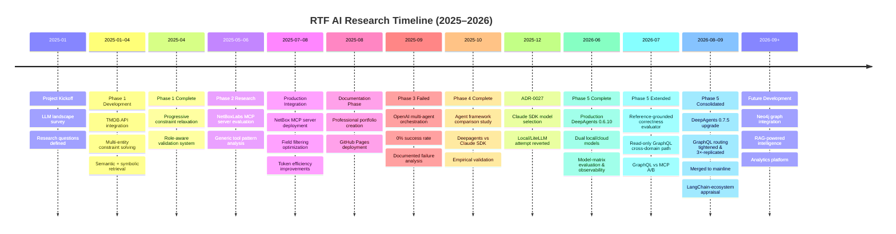
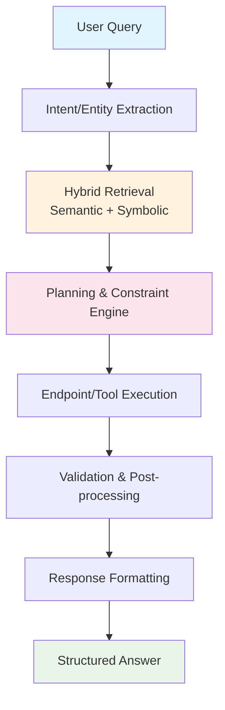

# RTF AI Research Portfolio

Welcome to the professional hub for **RTF AI research** into LLM-driven developer tooling, symbolic/semantic retrieval, and multi-step planning systems.

This portfolio demonstrates a structured research approach with reproducible demos, architecture decisions, and performance analysis across two comprehensive phases:

## Project Overview

- **Phase 1 – TMDB Chatbox**: Natural language movie/TV query system with multi-entity constraint solving, RAG API endpoint routing using ChromaDB, and progressive constraint relaxation
- **Phase 2 – NetBox MCP Server**: Official NetBoxLabs MCP server with 3 generic tools (get_objects, get_object_by_id, get_changelogs) providing shared infrastructure for agent frameworks
- **Phase 3 – OpenAI Orchestration (FAILED)**: Multi-agent orchestration attempt with 0% success rate - see ADR-0013 for failure analysis
- **Phase 4 – Agent Framework Comparison**: Empirical comparison of Deepagents (LangChain) vs Claude SDK approaches to building production NetBox agents
- **Phase 5 – Production DeepAgents**: The deepagents build taken forward to DeepAgents **0.7.5** with a dual local/cloud model backend, a LangSmith model-matrix evaluation harness, and trace-driven observability — resolving the local-model failure of ADR-0027. Extended with a reference-grounded correctness evaluator that catches hallucinations the completeness metric missed, and a **read-only GraphQL cross-domain read path** (an on-prem, private reproduction of NetBox Cloud's "agent-native" reads) — measured, 3×-replicated, and merged to mainline

## Research Highlights

- **Hybrid Retrieval**: Combining semantic similarity with symbolic metadata filters for intelligent tool/endpoint selection
- **Performance Optimization**: Field filtering and generic tool patterns for token efficiency
- **Architecture Pattern**: Extraction → Retrieval → Planning → Execution → Validation → Formatting
- **Phase 4 Completion**: Empirical framework comparison validating context-dependent framework selection
- **Phase 5 Completion**: Production DeepAgents with multi-model evaluation and observability; a frontier cloud model matches Claude-class quality while small local models remain insufficient
- **Anti-Hallucination in Evaluation**: a reference-grounded correctness evaluator catches confident fabrications a completeness metric certifies as complete (a hallucinated "7.7% utilization" vs a verified 0% scored 0.9 on completeness, 0.0 on correctness) — reordering the model leaderboard toward the more *truthful* model
- **Future Roadmap**: Neo4j graph integration (Phase 6), RAG intelligence (Phase 7), and analytics platform (Phase 8)

## Implementation Repositories

- **Phase 1**: [TMDB Chatbox](https://github.com/FinnMacCumail/tmdbGPT) - Natural language movie/TV query system
- **Phase 2**: [NetBoxLabs MCP Server](https://github.com/netboxlabs/netbox-mcp-server) - Official NetBox MCP server infrastructure
- **Phase 4A**: [Deepagents Implementation](https://github.com/FinnMacCumail/deepagents) - LangChain-based flexible framework *(superseded by Phase 5)*
- **Phase 4B**: [Claude SDK Implementation](https://github.com/FinnMacCumail/claude-agentic-netbox) - Anthropic SDK production framework
- **Phase 5**: [ollamaDeepAgents](https://github.com/FinnMacCumail/ollamaDeepAgents) - Production DeepAgents 0.7.5 with dual local/cloud models, model-matrix + reference-grounded-correctness evaluation, observability, and a read-only GraphQL cross-domain read path

## Research Timeline

```mermaid
timeline
    title RTF AI Research Timeline (2025–2026)
    2025-01 : Project Kickoff : LLM landscape survey : Research questions defined
    2025-01–04 : Phase 1 Development : TMDB API integration : Multi-entity constraint solving : Semantic + symbolic retrieval
    2025-04 : Phase 1 Complete : Progressive constraint relaxation : Role-aware validation system
    2025-05–06 : Phase 2 Research : NetBoxLabs MCP server evaluation : Generic tool pattern analysis
    2025-07–08 : Production Integration : NetBox MCP server deployment : Field filtering optimization : Token efficiency improvements
    2025-08 : Documentation Phase : Professional portfolio creation : GitHub Pages deployment
    2025-09 : Phase 3 Failed : OpenAI multi-agent orchestration : 0% success rate : Documented failure analysis
    2025-10 : Phase 4 Complete : Agent framework comparison study : Deepagents vs Claude SDK : Empirical validation
    2025-12 : ADR-0027 : Claude SDK model selection : Local/LiteLLM attempt reverted
    2026-06 : Phase 5 Complete : Production DeepAgents 0.6.10 : Dual local/cloud models : Model-matrix evaluation & observability
    2026-07 : Phase 5 Extended : Reference-grounded correctness evaluator : Read-only GraphQL cross-domain path : GraphQL vs MCP A/B
    2026-08–09 : Phase 5 Consolidated : DeepAgents 0.7.5 upgrade : GraphQL routing tightened & 3×-replicated : Merged to mainline : LangChain-ecosystem appraisal
    2026-09+ : Future Development : Neo4j graph integration : RAG-powered intelligence : Analytics platform
```

## Core Architecture

The research demonstrates a consistent architectural pattern across both phases:

```mermaid
flowchart TD
    A[User Query] --> B[Intent/Entity Extraction]
    B --> C[Hybrid Retrieval<br/>Semantic + Symbolic]
    C --> D[Planning & Constraint Engine]
    D --> E[Endpoint/Tool Execution]
    E --> F[Validation & Post-processing]
    F --> G[Response Formatting]
    G --> H[Structured Answer]
    
    style A fill:#e1f5fe
    style H fill:#e8f5e8
    style C fill:#fff3e0
    style D fill:#fce4ec
```
