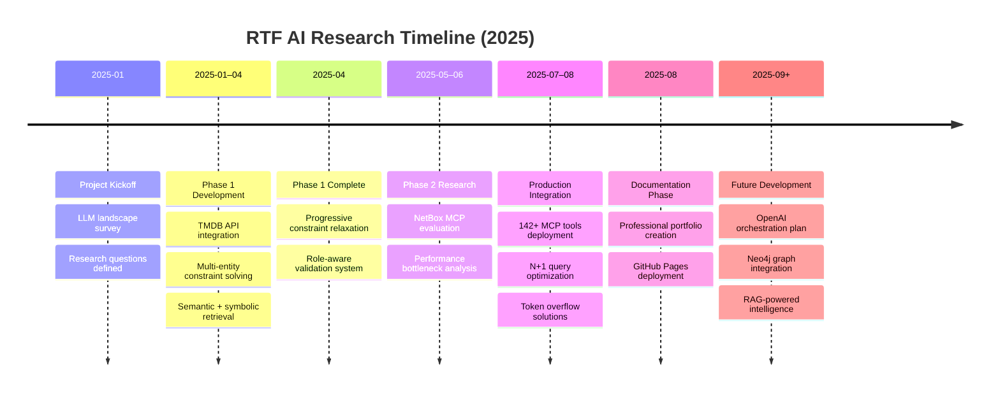

# RTF AI Research Portfolio

Welcome to the professional hub for **RTF AI research** into LLM-driven developer tooling, symbolic/semantic retrieval, and multi-step planning systems.

This portfolio demonstrates a structured research approach with reproducible demos, architecture decisions, and performance analysis across two comprehensive phases:

## Project Overview

- **Phase 1 – TMDB Chatbox**: Natural language movie/TV query system with multi-entity constraint solving, semantic search using ChromaDB, and progressive constraint relaxation
- **Phase 2 – NetBox MCP Integration**: Enterprise-grade NetBox MCP server with 142+ tools, performance optimization for token overflow and N+1 query issues

## Research Highlights

- **Hybrid Retrieval**: Combining semantic similarity with symbolic metadata filters for intelligent tool/endpoint selection  
- **Performance Optimization**: Solved critical N+1 query patterns (VLAN queries: 127 API calls → optimized batching)
- **Architecture Pattern**: Extraction → Retrieval → Planning → Execution → Validation → Formatting
- **Future Roadmap**: Four-phase OpenAI orchestration plan targeting 99% cost reduction and 15-50x performance improvements

## Implementation Repositories

- **Phase 1**: [TMDB Chatbox](https://github.com/FinnMacCumail/tmdbGPT) - Natural language movie/TV query system
- **Phase 2**: [NetBox MCP Server](https://github.com/FinnMacCumail/mcp-netbox) - Enterprise network operations integration

## Research Timeline

## Core Architecture

The research demonstrates a consistent architectural pattern across both phases:

