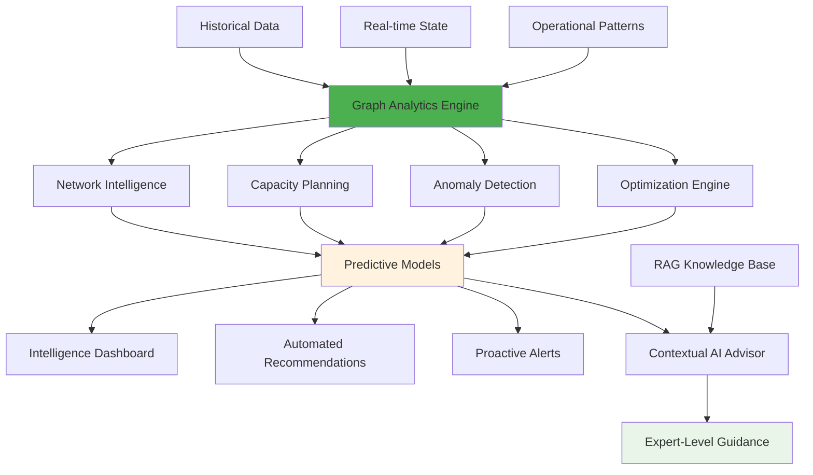

# Phase 7: Advanced Analytics Platform

## Objective

Transform the system into an **intelligent infrastructure advisor** using Neo4j graph algorithms, statistical analysis, and OpenAI reasoning to provide insights and predictive capabilities impossible with traditional approaches.

## Strategic Vision

Create a **comprehensive infrastructure intelligence platform** that not only answers questions about current state but predicts future needs, identifies optimization opportunities, and provides data-driven recommendations based on graph theory, operational patterns, and predictive modeling.



## Graph-Powered Network Analytics

### Network Intelligence Algorithms

```python
from neo4j import GraphDatabase
import networkx as nx
from typing import Dict, List, Tuple
import numpy as np

class NetworkIntelligenceEngine:
    def __init__(self, neo4j_driver):
        self.driver = neo4j_driver
        self.algorithms = {
            'centrality': self.analyze_network_centrality,
            'bottlenecks': self.identify_bottlenecks,
            'redundancy': self.analyze_redundancy_paths,
            'communities': self.detect_network_communities,
            'critical_paths': self.find_critical_paths
        }
    
    async def analyze_network_centrality(self) -> Dict[str, Any]:
        """
        Identify critical devices using multiple centrality measures
        """
        async with self.driver.session() as session:
            # PageRank centrality - identifies devices that are important hubs
            pagerank_query = """
            CALL gds.pageRank.stream('networkGraph')
            YIELD nodeId, score
            MATCH (d:Device) WHERE id(d) = nodeId
            RETURN d.name as device_name, d.device_type as device_type, score
            ORDER BY score DESC
            LIMIT 20
            """
            
            pagerank_result = await session.run(pagerank_query)
            pagerank_data = await pagerank_result.data()
            
            # Betweenness centrality - identifies devices critical for connectivity
            betweenness_query = """
            CALL gds.betweenness.stream('networkGraph')
            YIELD nodeId, score
            MATCH (d:Device) WHERE id(d) = nodeId
            RETURN d.name as device_name, score
            ORDER BY score DESC
            LIMIT 20
            """
            
            betweenness_result = await session.run(betweenness_query)
            betweenness_data = await betweenness_result.data()
            
        return {
            'hub_devices': pagerank_data,
            'bridge_devices': betweenness_data,
            'analysis_summary': self.generate_centrality_insights(pagerank_data, betweenness_data)
        }
    
    async def identify_bottlenecks(self) -> Dict[str, Any]:
        """
        Identify network bottlenecks using graph analysis and utilization data
        """
        async with self.driver.session() as session:
            # Find interfaces with high betweenness centrality and high utilization
            bottleneck_query = """
            CALL gds.betweenness.stream('interfaceGraph')
            YIELD nodeId, score
            MATCH (i:Interface) WHERE id(i) = nodeId
            MATCH (i)<-[:HAS_INTERFACE]-(d:Device)
            WITH i, d, score
            WHERE i.utilization_percent > 70 AND score > 0.1
            RETURN d.name as device_name, 
                   i.name as interface_name,
                   i.utilization_percent as utilization,
                   score as centrality_score,
                   i.bandwidth as max_bandwidth
            ORDER BY score * (i.utilization_percent / 100.0) DESC
            """
            
            bottlenecks = await session.run(bottleneck_query)
            bottleneck_data = await bottlenecks.data()
            
        # Analyze patterns in bottleneck data
        bottleneck_analysis = self.analyze_bottleneck_patterns(bottleneck_data)
        
        return {
            'current_bottlenecks': bottleneck_data,
            'pattern_analysis': bottleneck_analysis,
            'recommendations': self.generate_bottleneck_recommendations(bottleneck_data)
        }
    
    def analyze_bottleneck_patterns(self, bottleneck_data: List[Dict]) -> Dict[str, Any]:
        """
        Identify patterns in network bottlenecks
        """
        if not bottleneck_data:
            return {'pattern': 'no_bottlenecks_detected'}
        
        # Group by device type
        device_types = {}
        for bottleneck in bottleneck_data:
            device_name = bottleneck['device_name']
            # Extract device type from name (assuming naming convention)
            device_type = self.extract_device_type(device_name)
            device_types.setdefault(device_type, []).append(bottleneck)
        
        # Analyze utilization distribution
        utilizations = [b['utilization'] for b in bottleneck_data]
        avg_utilization = np.mean(utilizations)
        max_utilization = np.max(utilizations)
        
        # Identify patterns
        patterns = []
        if len(device_types.get('core', [])) > 1:
            patterns.append('core_overload')
        if avg_utilization > 85:
            patterns.append('widespread_congestion')
        if max_utilization > 95:
            patterns.append('critical_saturation')
        
        return {
            'patterns': patterns,
            'affected_device_types': list(device_types.keys()),
            'severity_metrics': {
                'average_utilization': avg_utilization,
                'maximum_utilization': max_utilization,
                'bottleneck_count': len(bottleneck_data)
            }
        }
```

### Predictive Capacity Planning

```python
import pandas as pd
from sklearn.linear_model import LinearRegression
from sklearn.preprocessing import PolynomialFeatures
import matplotlib.pyplot as plt
from datetime import datetime, timedelta

class CapacityPlanningEngine:
    def __init__(self, neo4j_driver, metrics_db):
        self.driver = neo4j_driver
        self.metrics_db = metrics_db
        self.models = {}
    
    async def generate_capacity_forecast(self, forecast_months: int = 12) -> Dict[str, Any]:
        """
        Generate capacity forecasts based on historical trends and growth patterns
        """
        # Gather historical utilization data
        historical_data = await self.collect_historical_utilization(months=24)
        
        # Build predictive models for different infrastructure components
        forecasts = {}
        
        for component_type in ['interfaces', 'power', 'rack_space', 'ip_space']:
            component_data = historical_data[component_type]
            
            if len(component_data) >= 12:  # Need at least 12 months of data
                model = self.build_growth_model(component_data)
                forecast = self.generate_forecast(model, component_data, forecast_months)
                forecasts[component_type] = forecast
        
        # Identify capacity constraints and timeline
        constraints = self.identify_capacity_constraints(forecasts)
        
        # Generate recommendations
        recommendations = self.generate_capacity_recommendations(forecasts, constraints)
        
        return {
            'forecasts': forecasts,
            'constraints': constraints,
            'recommendations': recommendations,
            'confidence_levels': self.calculate_forecast_confidence(forecasts)
        }
    
    def build_growth_model(self, time_series_data: List[Dict]) -> Dict[str, Any]:
        """
        Build growth prediction model using multiple techniques
        """
        df = pd.DataFrame(time_series_data)
        df['date'] = pd.to_datetime(df['date'])
        df = df.sort_values('date')
        
        # Create time-based features
        df['days_since_start'] = (df['date'] - df['date'].min()).dt.days
        df['month'] = df['date'].dt.month
        df['quarter'] = df['date'].dt.quarter
        
        X = df[['days_since_start', 'month', 'quarter']].values
        y = df['utilization_percent'].values
        
        # Try different models and select best performing
        models = {}
        
        # Linear regression
        linear_model = LinearRegression()
        linear_model.fit(X, y)
        linear_score = linear_model.score(X, y)
        models['linear'] = {'model': linear_model, 'score': linear_score}
        
        # Polynomial regression (degree 2)
        poly_features = PolynomialFeatures(degree=2)
        X_poly = poly_features.fit_transform(X)
        poly_model = LinearRegression()
        poly_model.fit(X_poly, y)
        poly_score = poly_model.score(X_poly, y)
        models['polynomial'] = {
            'model': poly_model, 
            'transformer': poly_features,
            'score': poly_score
        }
        
        # Select best model
        best_model_name = max(models.keys(), key=lambda k: models[k]['score'])
        best_model = models[best_model_name]
        
        return {
            'type': best_model_name,
            'model': best_model,
            'training_data': df,
            'feature_importance': self.analyze_feature_importance(best_model, X, y)
        }
    
    def generate_forecast(self, model_info: Dict, historical_data: List[Dict], 
                         forecast_months: int) -> Dict[str, Any]:
        """
        Generate future capacity predictions
        """
        model = model_info['model']
        last_date = max(d['date'] for d in historical_data)
        
        # Generate future dates
        future_dates = []
        for i in range(1, forecast_months + 1):
            future_date = last_date + timedelta(days=30 * i)
            future_dates.append(future_date)
        
        # Prepare features for prediction
        start_date = min(d['date'] for d in historical_data)
        
        predictions = []
        for future_date in future_dates:
            days_since_start = (future_date - start_date).days
            month = future_date.month
            quarter = (month - 1) // 3 + 1
            
            if model_info['type'] == 'linear':
                X_pred = [[days_since_start, month, quarter]]
                pred = model['model'].predict(X_pred)[0]
            elif model_info['type'] == 'polynomial':
                X_pred = [[days_since_start, month, quarter]]
                X_pred_poly = model['transformer'].transform(X_pred)
                pred = model['model'].predict(X_pred_poly)[0]
            
            predictions.append({
                'date': future_date,
                'predicted_utilization': max(0, min(100, pred)),  # Clamp to 0-100%
                'confidence_interval': self.calculate_prediction_confidence(pred, model_info)
            })
        
        return {
            'predictions': predictions,
            'model_type': model_info['type'],
            'model_accuracy': model['score'],
            'trend_analysis': self.analyze_growth_trend(predictions)
        }
    
    def identify_capacity_constraints(self, forecasts: Dict[str, Any]) -> List[Dict[str, Any]]:
        """
        Identify when capacity constraints will be reached
        """
        constraints = []
        capacity_thresholds = {
            'interfaces': 85,  # 85% interface utilization
            'power': 80,      # 80% power utilization  
            'rack_space': 90, # 90% rack utilization
            'ip_space': 85    # 85% IP space utilization
        }
        
        for component_type, forecast_data in forecasts.items():
            threshold = capacity_thresholds.get(component_type, 85)
            
            # Find when threshold will be crossed
            predictions = forecast_data['predictions']
            
            for prediction in predictions:
                if prediction['predicted_utilization'] >= threshold:
                    constraints.append({
                        'component': component_type,
                        'threshold_date': prediction['date'],
                        'predicted_utilization': prediction['predicted_utilization'],
                        'severity': self.calculate_constraint_severity(
                            prediction['predicted_utilization'], threshold
                        ),
                        'lead_time_months': self.calculate_lead_time(prediction['date'])
                    })
                    break  # First occurrence is what matters
        
        return sorted(constraints, key=lambda x: x['threshold_date'])
```

### Anomaly Detection & Pattern Recognition

```python
from sklearn.ensemble import IsolationForest
from sklearn.cluster import DBSCAN
import numpy as np

class NetworkAnomalyDetector:
    def __init__(self, neo4j_driver):
        self.driver = neo4j_driver
        self.baseline_models = {}
        
    async def detect_configuration_anomalies(self) -> Dict[str, Any]:
        """
        Detect devices with unusual configuration patterns
        """
        async with self.driver.session() as session:
            # Gather configuration metrics for all devices
            config_query = """
            MATCH (d:Device)-[:HAS_INTERFACE]->(i:Interface)
            WITH d, count(i) as interface_count,
                 avg(i.mtu) as avg_mtu,
                 count(CASE WHEN i.status = 'active' THEN 1 END) as active_interfaces
            MATCH (d)-[:MEMBER_OF_VLAN]->(v:VLAN)
            WITH d, interface_count, avg_mtu, active_interfaces, count(v) as vlan_count
            RETURN d.name as device_name,
                   d.device_type as device_type,
                   interface_count,
                   avg_mtu,
                   active_interfaces,
                   vlan_count,
                   d.location as location
            """
            
            result = await session.run(config_query)
            config_data = await result.data()
        
        if len(config_data) < 10:  # Need minimum data for anomaly detection
            return {'anomalies': [], 'status': 'insufficient_data'}
        
        # Prepare data for anomaly detection
        feature_matrix = self.prepare_anomaly_features(config_data)
        
        # Use Isolation Forest for anomaly detection
        isolation_forest = IsolationForest(
            contamination=0.1,  # Expect ~10% anomalies
            random_state=42
        )
        
        anomaly_scores = isolation_forest.fit_predict(feature_matrix)
        anomaly_decision_scores = isolation_forest.decision_function(feature_matrix)
        
        # Identify anomalous devices
        anomalies = []
        for i, (score, decision_score) in enumerate(zip(anomaly_scores, anomaly_decision_scores)):
            if score == -1:  # Anomaly detected
                device_data = config_data[i]
                anomaly_details = self.analyze_specific_anomaly(device_data, config_data)
                
                anomalies.append({
                    'device_name': device_data['device_name'],
                    'device_type': device_data['device_type'],
                    'anomaly_score': float(decision_score),
                    'anomaly_reasons': anomaly_details,
                    'severity': self.calculate_anomaly_severity(decision_score, anomaly_details)
                })
        
        return {
            'anomalies': sorted(anomalies, key=lambda x: x['anomaly_score']),
            'total_devices_analyzed': len(config_data),
            'anomaly_rate': len(anomalies) / len(config_data),
            'detection_summary': self.summarize_anomaly_patterns(anomalies)
        }
    
    def analyze_specific_anomaly(self, device_data: Dict, all_devices: List[Dict]) -> List[str]:
        """
        Identify specific reasons why a device is considered anomalous
        """
        reasons = []
        
        # Compare with devices of same type
        same_type_devices = [d for d in all_devices 
                           if d['device_type'] == device_data['device_type']]
        
        if len(same_type_devices) > 3:  # Need enough samples for comparison
            # Interface count anomaly
            type_interface_counts = [d['interface_count'] for d in same_type_devices]
            mean_interfaces = np.mean(type_interface_counts)
            std_interfaces = np.std(type_interface_counts)
            
            if abs(device_data['interface_count'] - mean_interfaces) > 2 * std_interfaces:
                reasons.append(f"Unusual interface count: {device_data['interface_count']} "
                             f"(typical: {mean_interfaces:.1f} ± {std_interfaces:.1f})")
            
            # VLAN count anomaly
            type_vlan_counts = [d['vlan_count'] for d in same_type_devices]
            mean_vlans = np.mean(type_vlan_counts)
            std_vlans = np.std(type_vlan_counts)
            
            if abs(device_data['vlan_count'] - mean_vlans) > 2 * std_vlans:
                reasons.append(f"Unusual VLAN count: {device_data['vlan_count']} "
                             f"(typical: {mean_vlans:.1f} ± {std_vlans:.1f})")
        
        # MTU anomaly
        if device_data['avg_mtu'] and device_data['avg_mtu'] not in [1500, 9000, 1514]:
            reasons.append(f"Non-standard MTU: {device_data['avg_mtu']}")
        
        return reasons
```

### Intelligent Optimization Recommendations

```python
class NetworkOptimizationEngine:
    def __init__(self, neo4j_driver, rag_engine):
        self.driver = neo4j_driver
        self.rag = rag_engine
        
    async def generate_optimization_recommendations(self) -> Dict[str, Any]:
        """
        Generate comprehensive network optimization recommendations
        """
        # Analyze current network state
        network_analysis = await self.analyze_current_state()
        
        # Generate optimization opportunities
        optimizations = await self.identify_optimization_opportunities(network_analysis)
        
        # Enrich with historical context and best practices
        enriched_recommendations = await self.enrich_with_rag_context(optimizations)
        
        # Prioritize and estimate impact
        prioritized_recommendations = self.prioritize_recommendations(enriched_recommendations)
        
        return {
            'network_state': network_analysis,
            'recommendations': prioritized_recommendations,
            'estimated_benefits': self.calculate_optimization_benefits(prioritized_recommendations),
            'implementation_roadmap': self.create_implementation_roadmap(prioritized_recommendations)
        }
    
    async def identify_optimization_opportunities(self, network_analysis: Dict) -> List[Dict]:
        """
        Identify specific optimization opportunities based on analysis
        """
        opportunities = []
        
        # Load balancing opportunities
        if network_analysis.get('load_imbalance_detected'):
            load_balancing = await self.analyze_load_balancing_opportunities()
            opportunities.extend(load_balancing)
        
        # Redundancy optimization
        if network_analysis.get('redundancy_gaps'):
            redundancy_opts = await self.analyze_redundancy_optimization()
            opportunities.extend(redundancy_opts)
        
        # Power optimization
        if network_analysis.get('power_inefficiencies'):
            power_opts = await self.analyze_power_optimization()
            opportunities.extend(power_opts)
        
        # IP space optimization
        if network_analysis.get('ip_fragmentation'):
            ip_opts = await self.analyze_ip_optimization()
            opportunities.extend(ip_opts)
        
        return opportunities
    
    async def enrich_with_rag_context(self, optimizations: List[Dict]) -> List[Dict]:
        """
        Enhance optimization recommendations with organizational context and best practices
        """
        enriched = []
        
        for optimization in optimizations:
            # Query RAG system for relevant context
            context_query = f"best practices {optimization['type']} optimization {optimization['description']}"
            
            relevant_docs = await self.rag.retrieve_relevant_context(
                context_query,
                query_type='optimization',
                max_contexts=3
            )
            
            # Extract best practices and considerations
            best_practices = self.extract_best_practices(relevant_docs)
            risk_considerations = self.extract_risk_considerations(relevant_docs)
            
            enriched_optimization = {
                **optimization,
                'best_practices': best_practices,
                'risk_considerations': risk_considerations,
                'historical_context': self.get_historical_implementation_context(optimization),
                'organizational_alignment': self.assess_organizational_alignment(optimization)
            }
            
            enriched.append(enriched_optimization)
        
        return enriched
    
    def prioritize_recommendations(self, recommendations: List[Dict]) -> List[Dict]:
        """
        Prioritize recommendations based on impact, effort, and risk
        """
        for rec in recommendations:
            # Calculate priority score
            impact_score = self.calculate_impact_score(rec)
            effort_score = self.calculate_effort_score(rec)
            risk_score = self.calculate_risk_score(rec)
            
            # Weighted priority calculation
            priority_score = (
                impact_score * 0.4 +
                (1 - effort_score) * 0.3 +  # Lower effort = higher priority
                (1 - risk_score) * 0.3      # Lower risk = higher priority
            )
            
            rec['priority_score'] = priority_score
            rec['priority_tier'] = self.determine_priority_tier(priority_score)
            rec['estimated_timeline'] = self.estimate_implementation_timeline(rec)
        
        return sorted(recommendations, key=lambda x: x['priority_score'], reverse=True)
```

## Production-Grade Analytics Dashboard

### Real-Time Intelligence Dashboard

```python
from fastapi import FastAPI, WebSocket
from fastapi.responses import HTMLResponse
import asyncio
import json

class IntelligenceDashboard:
    def __init__(self, analytics_engine, websocket_manager):
        self.analytics = analytics_engine
        self.websocket_manager = websocket_manager
        self.app = FastAPI()
        self.setup_routes()
        
    def setup_routes(self):
        @self.app.get("/dashboard")
        async def dashboard():
            return HTMLResponse(self.get_dashboard_html())
        
        @self.app.websocket("/ws")
        async def websocket_endpoint(websocket: WebSocket):
            await self.websocket_manager.connect(websocket)
            try:
                while True:
                    # Send real-time updates
                    analytics_update = await self.get_real_time_analytics()
                    await self.websocket_manager.send_personal_message(
                        json.dumps(analytics_update), 
                        websocket
                    )
                    await asyncio.sleep(30)  # Update every 30 seconds
            except Exception as e:
                await self.websocket_manager.disconnect(websocket)
    
    async def get_real_time_analytics(self) -> Dict[str, Any]:
        """
        Gather real-time analytics for dashboard display
        """
        # Parallel execution of analytics
        tasks = [
            self.analytics.get_network_health_score(),
            self.analytics.get_capacity_status(),
            self.analytics.get_anomaly_alerts(),
            self.analytics.get_optimization_opportunities(),
            self.analytics.get_predictive_insights()
        ]
        
        health, capacity, anomalies, optimizations, predictions = await asyncio.gather(*tasks)
        
        return {
            'timestamp': datetime.utcnow().isoformat(),
            'network_health': health,
            'capacity_status': capacity,
            'active_anomalies': anomalies,
            'top_optimizations': optimizations[:5],  # Top 5 recommendations
            'predictions': predictions,
            'system_status': 'operational'
        }
```

## Success Metrics & KPIs

### Technical Excellence Metrics
- **Query Performance**: 95% of analytical queries complete within 3 seconds
- **Prediction Accuracy**: 85%+ accuracy for capacity forecasts 6 months out
- **Anomaly Detection**: 90%+ precision with <5% false positive rate
- **System Scalability**: Handle 50,000+ devices with linear performance scaling

### Business Value Metrics
- **Operational Efficiency**: 70% reduction in manual network analysis time
- **Proactive Issue Prevention**: 60% of potential issues identified before impact
- **Capacity Planning Accuracy**: 90% accuracy in capacity requirement predictions
- **Cost Optimization**: 25% reduction in infrastructure costs through optimization recommendations

### User Adoption Metrics
- **Dashboard Usage**: Daily active users representing 80% of network operations team
- **Recommendation Implementation**: 70% of high-priority recommendations implemented within 6 months
- **User Satisfaction**: 90%+ satisfaction rating for analytical insights quality
- **Training Efficiency**: 50% reduction in time to train new network engineers

### Innovation Metrics
- **New Insights Discovery**: 10+ previously unknown network patterns identified per quarter
- **Automation Opportunities**: 15+ manual processes identified for automation annually
- **Predictive Accuracy Improvement**: 5% quarterly improvement in prediction models
- **Knowledge Base Growth**: 25% quarterly growth in actionable insights documented

## Platform Integration & Extensibility

### API-First Architecture
```python
@app.get("/api/v1/analytics/network-intelligence")
async def get_network_intelligence(
    analysis_type: str = "full",
    include_predictions: bool = True,
    forecast_months: int = 12
):
    """
    Comprehensive network intelligence API endpoint
    """
    intelligence = await analytics_engine.generate_comprehensive_intelligence(
        analysis_type=analysis_type,
        include_predictions=include_predictions,
        forecast_months=forecast_months
    )
    
    return {
        'analysis': intelligence,
        'generated_at': datetime.utcnow().isoformat(),
        'version': '4.0',
        'confidence_level': intelligence.get('confidence_level', 'medium')
    }
```

This final phase creates a truly **intelligent infrastructure platform** that transforms network operations from reactive maintenance to proactive optimization and predictive management, delivering enterprise-grade analytics capabilities that rival dedicated network management platforms.