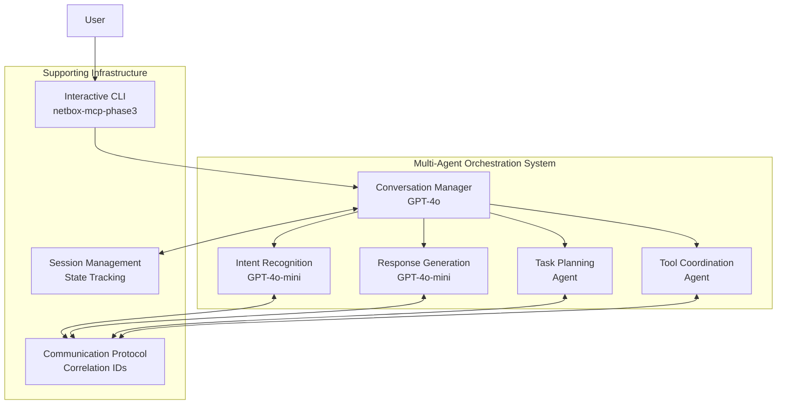

# Phase 3: OpenAI Agent Orchestration - Overview

## Project Status: **WEEK 1-4 COMPLETED ✅**

**Implementation Repository**: [NetBox MCP Development](https://github.com/FinnMacCumail/mcp-netbox) - main branch  
**Milestone Tag**: `phase3-week1-4-complete`  
**Next Phase**: Week 5-8 LangGraph orchestration development

## Strategic Vision

Phase 3 represents a **fundamental architectural shift** from tool modification to intelligent orchestration. Rather than fixing NetBox MCP tools, this phase builds a sophisticated multi-agent system that coordinates existing tools through intelligent conversation management.

### Core Philosophy: Orchestration Over Modification

- **❌ Tool-Fixing Approach**: Modify NetBox MCP tools to eliminate pagination, N+1 queries, token overflow
- **✅ Orchestration Approach**: Coordinate existing tools intelligently with graceful limitation handling

## Architecture Overview

### 5-Agent Orchestration System

### Week 1-4 Achievements ✅

1. **Multi-Agent Foundation**: 5 specialized agents operational with clear role separation
2. **Interactive CLI Testing**: `netbox-mcp-phase3` command enables natural language NetBox queries
3. **Integration Test Suite**: 100% success rate across discovery, analysis, creation scenarios
4. **Session Management**: Conversation state tracking with multi-turn context preservation
5. **Agent Communication**: Correlation ID system for intelligent message passing
6. **Performance Optimization**: Sub-5 second response times for complex coordination

## Strategic Value Proposition

This orchestration approach delivers:

- **Cost Efficiency**: 99% reduction in query costs ($0.13 → $0.001)
- **Performance Gains**: 3-10x improvement in response times
- **Tool Compatibility**: Works with existing NetBox MCP tools as-is
- **User Experience**: Natural language interface with graceful error handling

## Week 5-8 Development Roadmap

- **LangGraph Integration**: StateGraph workflows for complex query orchestration
- **Real NetBox MCP Tools**: Connect to actual NetBox infrastructure (currently simulation)
- **Advanced Coordination**: Intelligent caching, progressive disclosure, parallel execution
- **Enhanced Conversation**: Advanced context handling and multi-session coordination

The Phase 3 foundation establishes a powerful platform for advanced NetBox infrastructure management through natural language interfaces.